# Etude et Réalisation: Codeur de trame RDS
## RAPPORT DE PROJET

**Introduction**:

Le but de cette étude est de coder et de transmettre un texte à un récepteur FM RDS en utilisant le service de présentation du nom de la station (Program Service Name).
<br>
Pour plus de détails, 
voici un [document expliquant le fonctionnement du système RDS, ainsi que les consignes du travail à réaliser (cliquer).](files/Sujet_ER_CodeurRDS_DE10Lite.pdf)

Cette étude sera divisé en deux parties:

Dans un premier temps la trame binaire est fournie pour se focaliser uniquement sur le cadencement de la transmission. Cette partie consiste à générer les signaux d'horloge nécessaires pour la lecture et le codage de la trame binaire, à lire cette dernière bit pas bit en boucle d'une mémoire de type RAM bi port, et à coder en biphase. Un montage analogique sera branché en sortie et permettra à un récepteur du commerce d'afficher le nom de la station émise "GE1 FM".

Puis dans un second temps, le nom de la radio sera reçue par liaison série et la trame sera alors à coder selon la norme. Pour cela, un microprocesseur NIOS sera implanté dans le FPGA et le programme qui sera réalisé donnera la possibilité de recevoir le nom par liaison série, de former les quatres groupes nécessaires de la trame, et d'écrire les bits correspondants dans la mémoire RAM bi port. La première partie qui récupère le contenu de la RAM enverra donc à l'émetteur le nouveau nom. 

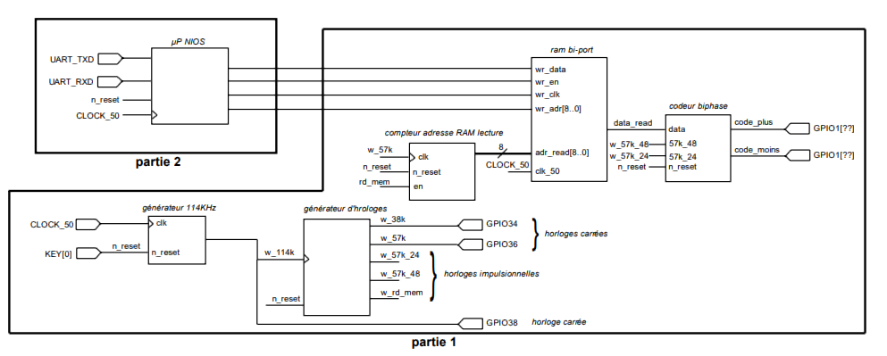
<div align="center"> Structure du codeur de trame RDS </div>

<br>

## Partie 1: Transmission de la trame binaire stocké en RAM
<br>

### 1. Générateur d'horloge 114 kHz

L'hologe de 114 kHz ne peut pas s'obtenir par une simple division de fréquence à partir de l'oscillateur de 50MHz de la carte DE10-Lite, car le facteur de division ne serait alors pas entier ( 50M/114k = 438,596491... ). Le design va donc utiliser un bloc interne du FPGA appelé DDL qui a la particularité de pouvroir multiplier et diviser la fréquence. Le bloc générateur de 114 kHz à étudier utilise ce bloc **atpll** qui fournira la fréquence de 114 kHz. 

Notre générateur d'horloge 114 kHz a:
* une entrée d'horloge (clk)
* une entrée de remise à zéro (n_reset)
* une sortie d'horloge (w_114k)

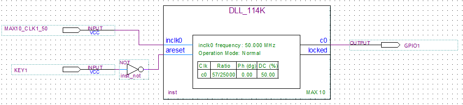
<div align="center"> Schéma interne de synthèse du générateur d'horloge 114 kHz.</div>

<br>

>Remaque: La porte inverseuse (NOT) permet d'avoir le fonctionnement voulus en prennant en compte le fait que les boutons poussoirs sur la carte DE10-Lite fournissent un niveau logique haut au repos.

Quartus nous permet de générer automatiquement le fichier vhdl correspondant au composant dont le schéma à été saisie, ainsi que son test bench (à compléter) nous permettant d'effectuer une simulation du composant. 

# AJOUTER SIMULATION MODELSIM
> je vais ajouter la partie simulation sur modelsim plus tard à l'IUT car ça ne fonctionne pas comme voulus chez moi.

Une fois la partie théorique validé, nous nous assurons du fonctionnement pratique du composant, en programmant la carte et en effectuant les mesures nécessaires à l'oscilloscope.

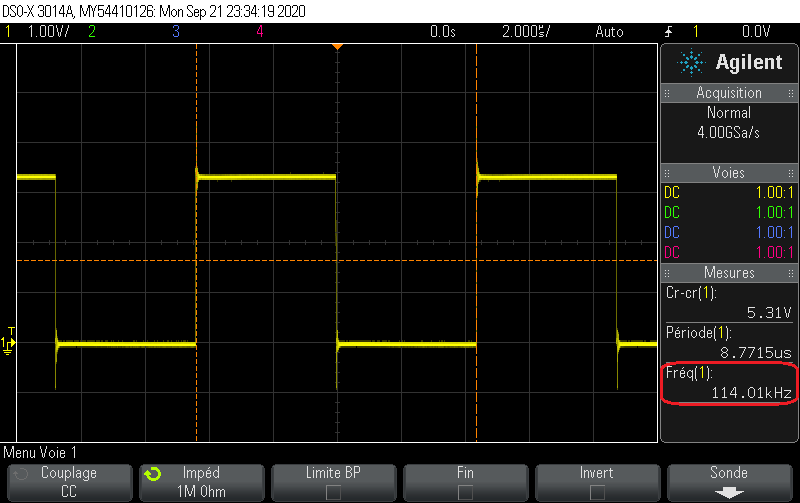
<div align="center"> Oscilloscope: Sortie du générateur d'horloge  114kHz </div>

<br>

L'oscilloscope mesure bien un signal carré à 114 kHz (à 10 Hz près) en sortie. De plus, lorsqu'on appuy sur le bouton poussoir de la carte, la sortie vaut 0V. Notre bloc générateur d'horloge 114 kHz fonctionne donc correctement. Nous pouvont en faire un symbole sur Quartus. 

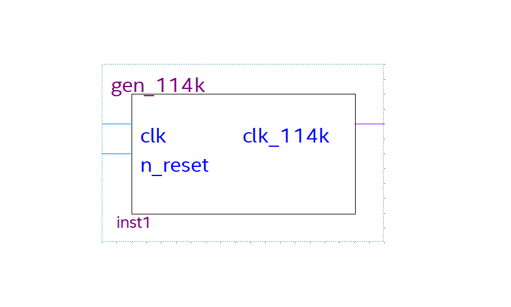
<div align="center"> Symbole du générateur d'horloge 114 kHz </div>

<br>

### 2. Générateur de signaux d'horloge

Le bloc générateur de signaux d'horloge va permettre de délivrer à partir du signal d'entré de 114 kHz (**w_114k**):
* un signal carré de 57 kHz (**w_57k**).
* un signal impulsionnel de 57/48 kHz (**w_57k_48**).
* un signal impulsionnel de 57/24 kHz (**w_57k_24**).
* un signal impulsionnel de commande du compteur d'adresse mémoire de la RAM bi port (**w_rd_mem**).

Les contraintes du cahier des charges sont les suivantes:
* les impulsions durent une période de **w_57k**, donc 2 périodes de **w_114k**.
* le signal **w_57k_48** est délivré en premier
* le signal **w_57k_24** est en retard d'une periode de **w_114k** par rapport au signal **w_57k_48** kHz pour permettre au codeur biphase d'échantillonner correctement la donnée à coder.
* le signal **w_rd_mem** a une fréquence de 57/48 kHz
* l'impulsion de **w_rd_mem** se situe entre deux impulsions de **w_57k_48** pour permettre à la mémoire de délivrer sa donnée avant qu'elle ne soit échantillonnée par le codeur biphase. 

Notre générateur de signaux d'horloges a également une entrée de remise à zéro (**n_reset**) qui doit être asynchrone, étant donné qu'elle est commune a tous les blocs de notre codeur et que son action arrête donc également l'horloge 114 kHz qui cadence notre générateur de signaux d'horloges. Etant donné que nos boutons poussoirs produisent un niveau logique haut au repos, **n_reset** doit être actif à 0.

<br>

Voici donc le programme VHDL décrivant le comportement de notre générateur de signaux d'horloges suivis de son _test bench_ (banc d'essai).

```vhdl
-- GENERATEUR DE SIGNAUX D'HORLOGE

-- Bibliothèques
library ieee;
use ieee.std_logic_1164.all;
use ieee.numeric_std.all;

entity gen_horloges is 
	port
	(
	 w_114k: in std_logic; -- horloge d'entrée
	 n_reset: in std_logic; -- remise à zéro
	 w_38k: out std_logic; -- !non utilisé!
	 w_57k: out std_logic; -- horloge 57 kHz
	 w_57k_24: out std_logic; -- impulsion 57/48 kHz
	 w_57k_48: out std_logic; -- impulsion 57/24 kHz
	 w_rd_mem: out std_logic -- commande du compteur d'adresse 
	);
end entity gen_horloges;

architecture a_gen_horloges of gen_horloges is

 	signal cpt: integer range 0 to 95:=0;
	signal i_w_57k: std_logic:='0';

begin

	w_57k <= i_w_57k;	
	

	process(w_114k, n_reset)
	begin
	if n_reset='0' then 
		cpt<=0;
		i_w_57k<='0';
		w_57k_24<='0';
		w_57k_48<='0';
		w_rd_mem<='0';
	elsif rising_edge(w_114k) then
		i_w_57k <= not i_w_57k;	

		if cpt<95 then
		cpt<=cpt+1;
		else
		cpt<=0;
		end if;

		if cpt=0 then
		w_57k_48<='1';
		w_57k_24<='0';
		w_rd_mem<='0';
		elsif cpt=2 then 
		w_57k_48<='0';
		end if;

		if cpt=3 then
		w_57k_24<='1';
		elsif cpt=5 then
		w_57k_24<='0';
		elsif cpt=51 then
		w_57k_24<='1';
		elsif cpt=53 then
		w_57k_24<='0';
		end if;

		if cpt=47 then
		w_rd_mem<='1';
		elsif cpt=49 then
		w_rd_mem<='0';
		end if;
	end if;
	end process;
	

end architecture a_gen_horloges;
```

```vhdl
-- TEST BENCH: GENERATEUR DE SIGNAUX D'HORLOGES

-- Bibliothèques
library ieee;
use ieee.std_logic_1164.all;
use ieee.numeric_std.all;

entity test_bench is
end entity test_bench;

architecture a_test_bench of test_bench is

-- Composants
component gen_horloges is 
	port
	(
	 w_114k: in std_logic;
	 n_reset: in std_logic;
	 w_38k: out std_logic;
	 w_57k: out std_logic;
	 w_57k_24: out std_logic;
	 w_57k_48: out std_logic;
	 w_rd_mem: out std_logic
	);
end component;

    -- Signaux internes
	signal i_w_114k: std_logic:='0';
	signal i_n_reset: std_logic:='0';
	signal i_w_38k: std_logic;
	signal i_w_57k: std_logic;
	signal i_w_57k_24: std_logic;
	signal i_w_57k_48: std_logic;
	signal i_w_rd_mem: std_logic;


begin
    -- Instanciation
	DUT: gen_horloges port map(w_114k=>i_w_114k, n_reset=>i_n_reset, w_38k=> i_w_38k, w_57k=>i_w_57k, w_57k_24=>i_w_57k_24, w_57k_48=>i_w_57k_48, w_rd_mem=>i_w_rd_mem);  
	
    -- Simulation d'une horloge de 114kHz
	process
	begin
	wait for 4385 ns;
	i_w_114k<=not i_w_114k;
	end process;

    -- Simulation d'un comportement du signal de remize à zéro
	process
	begin
	wait for 10 us;
	i_n_reset <= '1';
	wait for 5 ms;
	i_n_reset <= '0';
	end process; 

    -- Fix la durée de la simulation à 10 ms
	process
	begin
	wait for 10 ms;
	assert false report ("fin de simul") severity failure;
	end process;


end architecture a_test_bench;
```
Ce _test bench_ nous permet d'obtenir les résultats de simulation suivants:

<br>

 
<div align="center"> Chronogramme 1: Générateur de signaux d'horloges </div>

<br>

Tout d'abord, on remarque que le signal **w_57k** est bien à 57kHz (la demi-periode de l'horloge 114kHz a été arrondie dans le _test bench_, d'où le léger écart de 13Hz). Ensuite, les impulsions durent bien une période de **w_57k**, et **w_57k_24** arrive juste après **w_57k_48**, séparé d'une periode de **w_114k**.

<br>


<div align="center"> Chronogramme 2: Générateur de signaux d'horloges </div>

> Calculs:
<br>
57k/48 = 1.1876k
<br>
57k/24 = 2.375k
<br>
<br>

Les signaux **w_57k_48** et **w_rd_mem** ont une fréquence de 57/48 kHz, et **w_57k_24** une fréquence de 57/24 kHz comme souhaité. De plus, on remarque que l'impulsion de **w_rd_mem** se trouve bien entre deux impulsions de **w_57k_48**. 

<br>


<div align="center"> Chronogramme 3: Générateur de signaux d'horloges </div>

<br>

Enfin, ce dernier chronogramme nous permet de mettre en evidence l'action asynchrone de **n_reset** bel et bien actif à 0, et le comportement synchrone des sorties.

> Ce dernier chronogramme a été obtenus après une légère modification du _test bench_ ("5 ms"->"400 us", "10 ms"->"100 ms")

<br>

Notre cahier des charges est donc théoriquement respecté. Nous pouvons passer aux mesures pratiques.
Après avoir généré le symbole du générateur de signaux d'horloges à partir du fichier vhdl, nous pouvons programmer la carte à partir du circuit suivant.

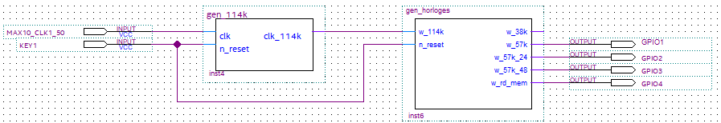
<div align="center"> Circuit test du générateur de signaux d'horloge </div>

<br>

Les mesures à l'oscilloscope donnent les résultats suivants:

<br>

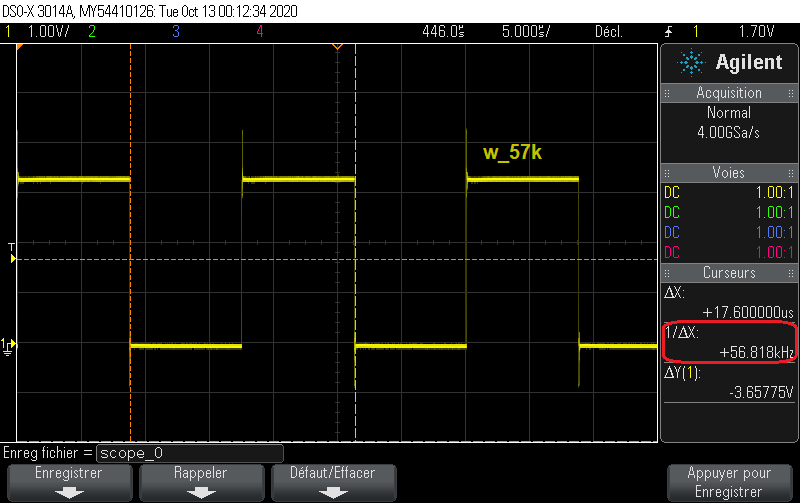
<div align="center"> Oscilloscope: Sortie w_57k du générateur de signaux d'horloge (GPIO1) </div>

<br>

Le signal **w_57k** est bien carré, de fréquence 57kHz 
> Remarque: On a un léger écart de 182Hz (~0.32% donc négligeable) vraisemblablement lié aux imprécisions de l'oscilloscope. De très légers écarts de mesures seront donc présents tout au long de cette étude.

<br>

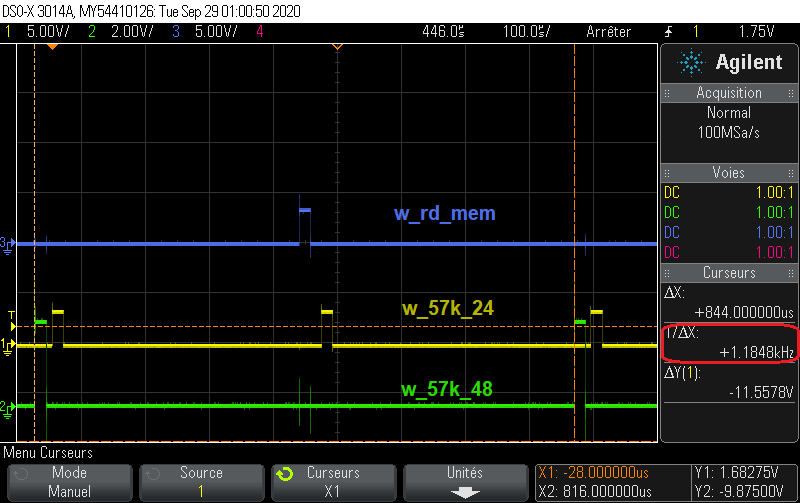
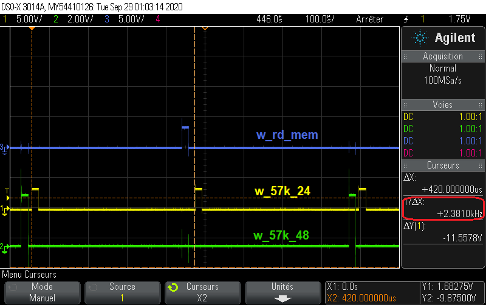
<div align="center"> Oscilloscope: Sorties du générateur de signaux d'horloge (w_rd_mem, w_57k_24, w_57_58) </div>

<br>

Le signal **w_57k_24** a bien une fréquence de 57/24 kHz, et **w_57k_48** une fréquence de 57/48 kHz.

<br>

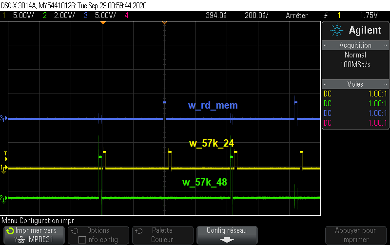
<div align="center"> Oscilloscope: vue globale des sorties du générateur de signaux d'horloge (w_rd_mem, w_57k_24, w_57_58) </div>

<br>

Dans cette dernière figure on voit bien que l'impulsion de **w_57k_24** arrive après celle de **w_57k_48**, et que l'impulsion de **w_rd_mem** se situe entre deux impulsions de **w_57k_48**.

Notre générateur de signaux d'horloge fonctionne donc comme voulus.

<br>

### 3. Compteur d'adresse de la RAM

Ce compteur d'adresse est un compteur qui permet à la RAM bi-port (bloc suivant) de savoir à quelle adresse lire la donnée à distribuer (bit de la trame). C'est un compteur full-synchrone qui incrémente l'adresse générée **adr_read**, à chaque impulsion de **w_rd_mem** (l'entrés s'appelle **en** pour ce bloc). Etant donné que notre trame à envoyer est composée de 416 bits, notre compteur d'adresse doit compter de 0 à 415, car charque bit est rangé à une adresse mémoire. Ainsi, nous obtenons le programme suivant.

```vhdl
-- COMPTEUR D'ADRESSE DE LA RAM

-- Bibliothèques
library ieee;
use ieee.std_logic_1164.all;
use ieee.numeric_std.all;


entity cpt_adresse is
	port
	(
	 clk:     in  std_logic;		   --horloge d'entree
	 n_reset: in  std_logic;		   --remise a zero
	 en:      in  std_logic;		   --permission/commande d'incrementer (w_rd_mem)
	 adr_read: out std_logic_vector(8 downto 0)--adresse generee (compteur)
	);
end entity cpt_adresse;


architecture a_cpt_adresse of cpt_adresse is
	
	-- Signaux internes
	signal i_cpt_adr: unsigned(8 downto 0):=to_unsigned(0, 9);

begin

	adr_read <= std_logic_vector(i_cpt_adr);


	process(clk, n_reset)--liste de sensibilite 
	begin

	if n_reset='0' then ----------------------------------------------------------------si la remise a zero est active, alors...
	   i_cpt_adr <= to_unsigned(0, 9);--------------------------------------------------remet le compteur a 0
	elsif ( rising_edge(clk)) and (en='1') and (i_cpt_adr<to_unsigned(415, 9) ) then----sinon, si la compteur est inferieur a 415, alors...
	   i_cpt_adr <= i_cpt_adr+1;--------------------------------------------------------incremente le compteur
	elsif ( rising_edge(clk)) and (en='1') and (i_cpt_adr>=to_unsigned(415,9) ) then----sinon, si le compeur est superieur ou EGAL a 415 alors...
	   i_cpt_adr <= to_unsigned(0, 9);--------------------------------------------------remet le compteur a 0
	end if;

	end process;


end architecture a_cpt_adresse;
```

Afin de vérifier le bon fonctionnement de ce compteur d'adresse mémoire nous proposons le _test bench_ suivant.

```vhdl
-- TEST BENCH: COMPTEUR D'ADRESSE DE LA RAM

-- Bibliotheques
library ieee;
use ieee.std_logic_1164.all;
use ieee.numeric_std.all;


entity tb_cpt_adresse is
end entity tb_cpt_adresse;


architecture a_tb_cpt_adresse of tb_cpt_adresse is

	-- Composants
	component cpt_adresse is
	port
	(
	 clk:      in  std_logic;          --horloge d'entree
	 n_reset:  in  std_logic;		   --remise a zero
	 en:       in  std_logic;		   --permission/commande d'incrementer (w_rd_mem)
	 adr_read: out std_logic_vector(8 downto 0)--adresse generee (compteur)
	);
	end component;

	-- Signaux internes
	signal i_clk: 		std_logic:='0';
	signal i_n_reset: 	std_logic:='1';
	signal i_en: 		std_logic:='0';
	signal i_adr_read: 	std_logic_vector(8 downto 0);

begin

	-- Instanciation
	DUT: cpt_adresse port map(clk=>i_clk, n_reset=>i_n_reset, en=>i_en, adr_read=>i_adr_read);

	-- Simulation d'une horloge de 57 kHz
	process
	begin
	wait for 8.77193 us;
	i_clk <= not i_clk;
	end process;

	-- Simulation d'un comportement de en (w_rd_mem)
	process
	begin
	wait for 350 us;
	i_en<='1';
	wait for 35 us;
 	i_en<='0';
	end process;

	-- Simulation d'un comportement de n_reset
	-- Fix la duree de simulation
	process
	begin
	wait for 1200 us;
	i_n_reset<='0';
	wait for 35 us;
	i_n_reset<='1';
	wait for 400 ms; 
	assert false report ("FIN DE SIMULATION") severity failure;
	end process;

end architecture a_tb_cpt_adresse;
	
```

La simulation nous donne les résultats suivants:
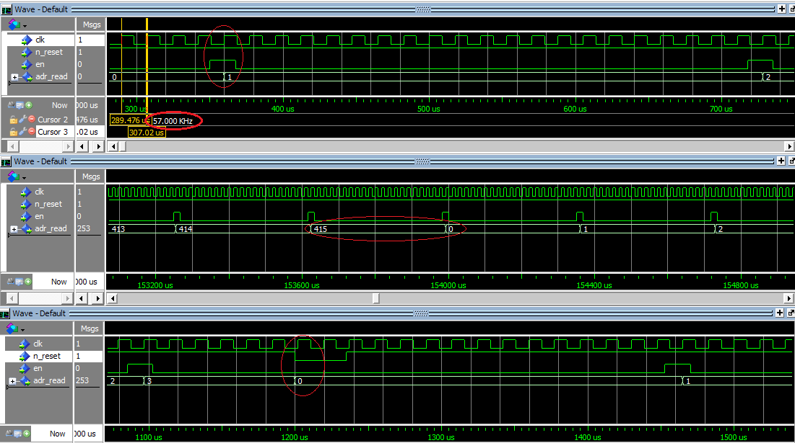
<div align="center"> Chronogramme: Compteur d'adresse de la RAM </div>

<br>

Ces résultats nous montrent d'une part, que le compteur commence à 0 et s'incrémente à chaque impulsion de **en** de manière synchrone. Et d'autre part, qu'une fois à 415, le compteur se remet à 0. Enfin, le dernier chronogramme nous montre l'action asynchrone de **n_reset** qui permet de réinitialiser le compteur.

<br>

Tout fonctionne correctement, nous pouvont donc générer le symbole correspondant au programme VHDL de notre compteur d'adresse.

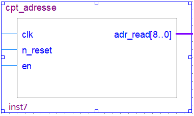
<div align="center"> Symbole du compteur d'adresse de la RAM </div>

<br>

### 4. Mémoire bi-port

C'est un bloc qui est chargé de transmettre en sortie la donnée **data_read** correspondant l'adresse fournis en entrée **adr_read**.
Dans cette partie, nous nous intéressons qu'à la transmission de la trame stocké en RAM. Pour ce faire, la trame initiale seras pré-enregistré dans notre RAM, à travers le fichier **Codeur_RDS.mif** qui nous est fournis. Ainsi, nous nous occuperons uniquement de l'entrée d'adresse **adr_read**, l'horloge d'entrée **clk_50M**, et la sortie de donnée **data_read**. Le bloc est constitué de deux sous-blocs, la **ram 2 ports**, et un **diviseur de fréquence par 50**.

Le diviseur de fréquence vas nous permettre d'obtenir une horloge 1MHz en sortie (**Q**), à partir d'une horloge 50MHz en entrée (**clk**). Voici ci-dessous les programmes correspondants.

```vhdl
-- DIVISEUR DE FREQUENCE PAR 50

--Bibliothèques
library ieee;
use ieee.std_logic_1164.all;
use ieee.numeric_std.all;


entity div_freq_50 is
	port
	(
	 clk: in std_logic;    --horloge d'entree
	 Q: out std_logic      --horloge de sortie
	);
end entity div_freq_50;


architecture a_div_freq_50 of div_freq_50 is

	--Signaux internes
	signal cpt: integer range 0 to 24:=0;  --compteur
	signal iQ: std_logic:='0';             --equivalent en signal interne de la sortie d'horloge

begin

	Q <= iQ;

	process
	begin
	wait until rising_edge(clk);
	if cpt<24 then
	cpt <= cpt+1;  --incremente 
	else 
	cpt <= 0;      --remet a zero
	iQ <= not iQ;
	end if;
	end process;

end architecture a_div_freq_50;
```
```vhdl
-- TEST BENCH: DIVISEUR DE FREQUENCE PAR 50

-- Bibliotheques
library ieee;
use ieee.std_logic_1164.all;
use ieee.numeric_std.all;


entity tb_div_freq_50 is
end entity tb_div_freq_50;


architecture a_tb_div_freq_50 of tb_div_freq_50 is

	--Composants
	component div_freq_50 is
		port
		(
	 	clk: in std_logic;    --horloge d'entree
	 	Q: out std_logic      --horloge de sortie
		);
	end component;

	--Signaux internes
	signal i_clk: 	std_logic:='0';
	signal i_Q: 	std_logic;

begin

	--Instanciation
	DUT: div_freq_50 port map (clk=>i_clk, Q=>i_Q);

	--Simulation de l'horloge 50 MHz
	process 
	begin
	wait for 10 ns;
	i_clk <= not i_clk;
	end process;

	--Fix la duree de simulation a 10 us
	process
	begin
	wait for 10 us;
	assert false report "FIN DE SIMULATION" severity failure;
	end process;

end architecture a_tb_div_freq_50;
```

Nous obtenons les résultats de simulation suivants:
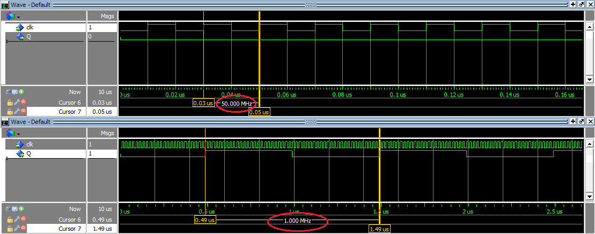
<div align="center"> Chronogramme: Diviseur de fréquence par 50 </div>

<br>

En fournissant un signal d'horloge à 50 MHz (**clk**) en entrée on obtiens bien un signal carré de 1 MHz en sortie (**Q**), donc notre diviseur de fréquence semble fonctionner. Pour le confirmer nous effectuons les mesures à l'oscilloscope.
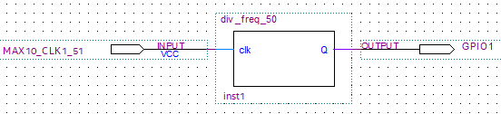
<div align="center"> Circuit test du diviseur de fréquence par 50 </div>

<br>

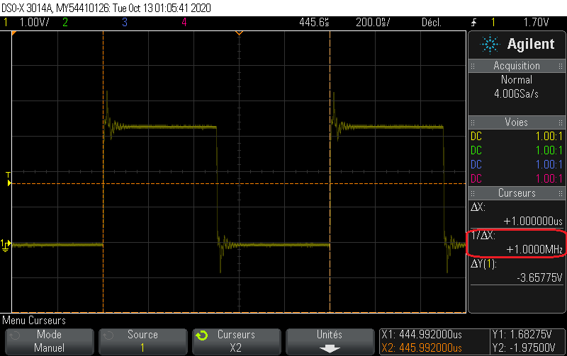
<div align="center"> Oscilloscope: Sortie du diviseur de fréquence par 50 </div>

<br>

Nous avons bien 1MHz en sortie, ce résultat nous confirme donc le bon fonctionnement du diviseur de fréquence.

La ram 2 ports est générée par Quartus à partir de nos configurations, après quoi, nous assemblons les deux sous-blocs pour former le circuit de notre mémoire bi-port.

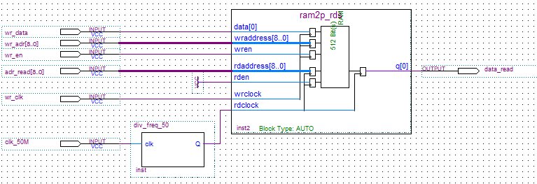
<div align="center"> Circuit interne de la mémoire bi-port </div>

<br>

Nous générons à partir de Quartus, les programmes vhdl correspondant au circuit ci-dessus, puis nous modifions le fichier test bench afin de simuler l'horloge 50 MHz **clk_50M**, et le compteur d'adresse **ard_read**. Les programmes ainsi obtenus sont les suivants:


Bloc mémoire bi-port:
```vhdl
-- Copyright (C) 2017  Intel Corporation. All rights reserved.
-- Your use of Intel Corporation's design tools, logic functions 
-- and other software and tools, and its AMPP partner logic 
-- functions, and any output files from any of the foregoing 
-- (including device programming or simulation files), and any 
-- associated documentation or information are expressly subject 
-- to the terms and conditions of the Intel Program License 
-- Subscription Agreement, the Intel Quartus Prime License Agreement,
-- the Intel FPGA IP License Agreement, or other applicable license
-- agreement, including, without limitation, that your use is for
-- the sole purpose of programming logic devices manufactured by
-- Intel and sold by Intel or its authorized distributors.  Please
-- refer to the applicable agreement for further details.

-- PROGRAM		"Quartus Prime"
-- VERSION		"Version 17.1.0 Build 590 10/25/2017 SJ Lite Edition"
-- CREATED		"Sat Oct 24 15:37:50 2020"

--Bibliothèques
LIBRARY ieee;
USE ieee.std_logic_1164.all; 

LIBRARY work;


ENTITY ram_biport IS 
	PORT
	(
		clk_50M :  IN  STD_LOGIC;                    --entree d'horloge
		wr_data :  IN  STD_LOGIC;                    --NON UTILISEE (Partie 2)        
		wr_en :  IN  STD_LOGIC;                      --NON UTILISEE (Partie 2)
		wr_clk :  IN  STD_LOGIC;                     --NON UTILISEE (Partie 2)
		adr_read :  IN  STD_LOGIC_VECTOR(8 DOWNTO 0);--entre d'adresse
		wr_adr :  IN  STD_LOGIC_VECTOR(8 DOWNTO 0);  --NON UTILISEE (Partie 2)
		data_read :  OUT  STD_LOGIC                  --sortie de donnée
	);
END ram_biport;

ARCHITECTURE bdf_type OF ram_biport IS 

--Composants
COMPONENT div_freq_50
	PORT(clk : IN STD_LOGIC;
		 Q : OUT STD_LOGIC
	);
END COMPONENT;

COMPONENT ram2p_rds
	PORT(wren : IN STD_LOGIC;
		 rden : IN STD_LOGIC;
		 wrclock : IN STD_LOGIC;
		 rdclock : IN STD_LOGIC;
		 data : IN STD_LOGIC_VECTOR(0 TO 0);
		 rdaddress : IN STD_LOGIC_VECTOR(8 DOWNTO 0);
		 wraddress : IN STD_LOGIC_VECTOR(8 DOWNTO 0);
		 q : OUT STD_LOGIC_VECTOR(0 TO 0)
	);
END COMPONENT;

--Signaux internes
SIGNAL	SYNTHESIZED_WIRE_0 :  STD_LOGIC;
SIGNAL	SYNTHESIZED_WIRE_1 :  STD_LOGIC;


BEGIN 
SYNTHESIZED_WIRE_0 <= '1';


b2v_inst : div_freq_50
PORT MAP(clk => clk_50M,
		 Q => SYNTHESIZED_WIRE_1);


b2v_inst2 : ram2p_rds
PORT MAP(wren => wr_en,
		 rden => SYNTHESIZED_WIRE_0,
		 wrclock => wr_clk,
		 rdclock => SYNTHESIZED_WIRE_1,
		 data(0) => wr_data,
		 rdaddress => adr_read,
		 wraddress => wr_adr,
		 q(0) => data_read);


END bdf_type;
```
Test bench du bloc mémoire bi-port:
```vhdl
-- Copyright (C) 2017  Intel Corporation. All rights reserved.
-- Your use of Intel Corporation's design tools, logic functions 
-- and other software and tools, and its AMPP partner logic 
-- functions, and any output files from any of the foregoing 
-- (including device programming or simulation files), and any 
-- associated documentation or information are expressly subject 
-- to the terms and conditions of the Intel Program License 
-- Subscription Agreement, the Intel Quartus Prime License Agreement,
-- the Intel FPGA IP License Agreement, or other applicable license
-- agreement, including, without limitation, that your use is for
-- the sole purpose of programming logic devices manufactured by
-- Intel and sold by Intel or its authorized distributors.  Please
-- refer to the applicable agreement for further details.

-- ***************************************************************************
-- This file contains a Vhdl test bench template that is freely editable to   
-- suit user's needs .Comments are provided in each section to help the user  
-- fill out necessary details.                                                
-- ***************************************************************************
-- Generated on "10/24/2020 15:41:48"
                                                            
-- Vhdl Test Bench template for design  :  ram_biport
-- 
-- Simulation tool : ModelSim-Altera (VHDL)
-- 

--Bibliothèques
LIBRARY ieee;                                               
USE ieee.std_logic_1164.all; 
use ieee.numeric_std.all;                               


ENTITY ram_biport_vhd_tst IS
END ram_biport_vhd_tst;


ARCHITECTURE ram_biport_arch OF ram_biport_vhd_tst IS
-- constants                                                 
-- signals                                                   
SIGNAL adr_read : STD_LOGIC_VECTOR(8 DOWNTO 0);
SIGNAL clk_50M : STD_LOGIC:='0';
SIGNAL data_read : STD_LOGIC;
SIGNAL wr_adr : STD_LOGIC_VECTOR(8 DOWNTO 0);
SIGNAL wr_clk : STD_LOGIC;
SIGNAL wr_data : STD_LOGIC;
SIGNAL wr_en : STD_LOGIC;
signal i: unsigned (8 downto 0):="000000000"; 

COMPONENT ram_biport
	PORT (
	adr_read : IN STD_LOGIC_VECTOR(8 DOWNTO 0);
	clk_50M : IN STD_LOGIC;
	data_read : OUT STD_LOGIC;
	wr_adr : IN STD_LOGIC_VECTOR(8 DOWNTO 0);
	wr_clk : IN STD_LOGIC;
	wr_data : IN STD_LOGIC;
	wr_en : IN STD_LOGIC
	);
END COMPONENT;
BEGIN
	i1 : ram_biport
	PORT MAP (
-- list connections between master ports and signals
	adr_read => adr_read,
	clk_50M => clk_50M,
	data_read => data_read,
	wr_adr => wr_adr,
	wr_clk => wr_clk,
	wr_data => wr_data,
	wr_en => wr_en
	);

	adr_read <= std_logic_vector(i);

	--Simulation de l'horloge 50 MHz
	PROCESS                            
	BEGIN
	wait for 10 ns;
	clk_50M <= not clk_50M;                            
	END PROCESS; 

	--Simulation du compteur d'adresse
	PROCESS                              
	BEGIN 
	wait for 842.105 us;
	if i = "110011111" then
	i <= "000000000"; 
	else   
	i <= i+1;
	end if;   
	END PROCESS;    

	--Fix la duree de simulation a 1 s
	process
	begin
	wait for 1000 ms;
	assert false report "FIN DE SIMULATION" severity failure;
	end process;
                                       
END ram_biport_arch;
```

Nous obtenons les résultats de simulation suivants:
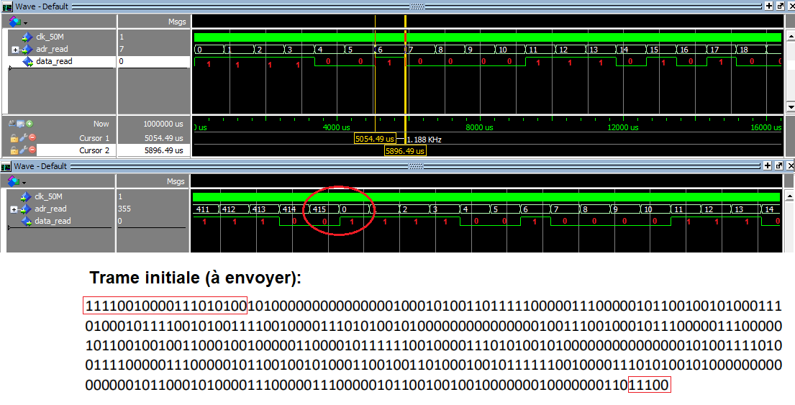
<div align="center"> Chronogramme: Mémoire bi-port </div>

<br>

Nous avons fait en sorte que le compteur d'adresse (**adr_read**) ait le comportement attendus, en l'incrémentant à une fréquence de 57/48 kHz, et en le faisant compter de 0 à 415. D'après les résultats de simulation, la trame obtenus en sortie semble correspondre à la trame initiale pré-enregistré. Une fois arrivé au dernier bit de la trame, la mémoire bi-port revient au premier bit, comme lui impose l'entrée d'adresse. Chaque bit dure aussi longtemp qu'une valeur du compteur. Notre mémoire bi-port fonctionne donc parfaitement et nous pouvons en faire un symbole.

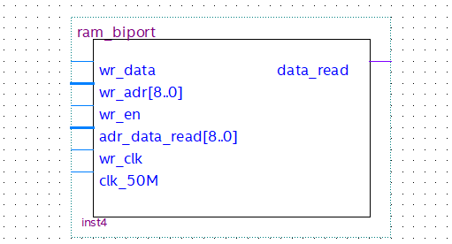
<div align="center"> Symbole de la mémoire bi-port </div>


