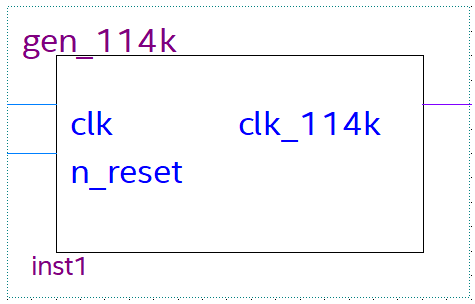
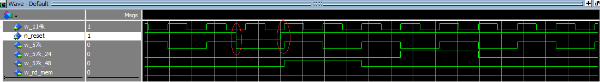

# RAPPORT DE PROJET

**Introduction**:

Le but de cette étude est de coder et de transmettre un texte à un récepteur FM RDS en utilisant le service de présentation du nom de la station (Program Service Name).
<br>

Cette étude sera divisée en deux parties:

Dans un premier temps la trame binaire est fournie pour se focaliser uniquement sur le cadencement de la transmission. Cette partie consiste à générer les signaux d'horloge nécessaires pour la lecture et le codage de la trame binaire, à lire cette dernière bit pas bit en boucle d'une mémoire de type RAM bi port, et à coder en biphase. Un montage analogique sera branché en sortie et permettra à un récepteur du commerce d'afficher le nom de la station émise "GE1 FM".

Puis dans un second temps, le nom de la radio sera reçue par liaison série et la trame sera alors à coder selon la norme. Pour cela, un microprocesseur NIOS sera implanté dans le FPGA (**F**iel **P**rogrammable **G**ate **A**rrays) et le programme qui sera réalisé donnera la possibilité de recevoir le nom par liaison série, de former les quatre groupes nécessaires de la trame, et d'écrire les bits correspondants dans la mémoire RAM bi port. La première partie qui récupère le contenu de la RAM enverra donc à l'émetteur, le nouveau nom. 


<div align="center"> Structure du codeur de trame RDS </div>

<br>

# Partie 1 : Transmission de la trame binaire stocké en RAM
<br>

## 1. Générateur d'horloge 114 kHz

L'horloge de 114 kHz ne peut pas s'obtenir par une simple division de fréquence à partir de l'oscillateur de 50MHz de la carte DE10-Lite, car le facteur de division ne serait alors pas entier ( 50M/114k = 438,596491... ). Le design va donc utiliser un bloc interne du FPGA appelé DDL qui a la particularité de pouvoir multiplier et diviser la fréquence. Le bloc générateur de 114 kHz à étudier utilise ce bloc **atpll** qui fournira la fréquence de 114 kHz. 

Notre générateur d'horloge 114 kHz a:
* une entrée d'horloge (clk)
* une entrée de remise à zéro (n_reset)
* une sortie d'horloge (w_114k)


<div align="center"> Schéma interne de synthèse du générateur d'horloge 114 kHz.</div>

<br>

>Remaque: La porte inverseuse (NOT) permet d'avoir le fonctionnement voulu en prenant en compte le fait que les boutons poussoirs sur la carte DE10-Lite fournissent un niveau logique haut au repos.

Quartus nous permet de générer automatiquement le fichier vhdl correspondant au composant dont le schéma à été saisie, ainsi que son _test bench_ (à compléter) nous permettant d'effectuer une simulation du composant. 

Voici le _test bench_ (banc de test) complété afin de simuler notre générateur d'horloge 114 kHz.

```vhdl
-- Copyright (C) 2017  Intel Corporation. All rights reserved.
-- Your use of Intel Corporation's design tools, logic functions 
-- and other software and tools, and its AMPP partner logic 
-- functions, and any output files from any of the foregoing 
-- (including device programming or simulation files), and any 
-- associated documentation or information are expressly subject 
-- to the terms and conditions of the Intel Program License 
-- Subscription Agreement, the Intel Quartus Prime License Agreement,
-- the Intel FPGA IP License Agreement, or other applicable license
-- agreement, including, without limitation, that your use is for
-- the sole purpose of programming logic devices manufactured by
-- Intel and sold by Intel or its authorized distributors.  Please
-- refer to the applicable agreement for further details.

-- ***************************************************************************
-- This file contains a Vhdl test bench template that is freely editable to   
-- suit user's needs .Comments are provided in each section to help the user  
-- fill out necessary details.                                                
-- ***************************************************************************
-- Generated on "10/24/2020 18:41:55"
                                                            
-- Vhdl Test Bench template for design  :  gen_114k
-- 
-- Simulation tool : ModelSim-Altera (VHDL)
-- 

-- TEST BENCH: GENERATEUR D'HORLOGE 114K

-- Bibliothèques
LIBRARY ieee;                                               
USE ieee.std_logic_1164.all;                                


ENTITY gen_114k_vhd_tst IS
END gen_114k_vhd_tst;


ARCHITECTURE gen_114k_arch OF gen_114k_vhd_tst IS
-- constants                                                 
-- signals                                                   
SIGNAL clk : STD_LOGIC:='0';
SIGNAL clk_114k : STD_LOGIC;
SIGNAL n_reset : STD_LOGIC:='1';

-- Composants
COMPONENT gen_114k
	PORT (
	clk : IN STD_LOGIC;
	clk_114k : OUT STD_LOGIC;
	n_reset : IN STD_LOGIC
	);
END COMPONENT;

BEGIN
	-- Instanciation
	i1 : gen_114k
	PORT MAP (
	-- list connections between master ports and signals
	clk => clk,
	clk_114k => clk_114k,
	n_reset => n_reset
	);

	-- Simulation d'une horloge de 50MHz
	PROCESS
	BEGIN
	wait for 10 ns;
	clk <= not clk;  
	END PROCESS;

	-- Simulation d'un comportement du signal de remise a zero
	PROCESS
	BEGIN
	wait for 50 us;
	n_reset <= '0';
	wait for 200 ns;
	n_reset <= '1';
	END PROCESS;

	-- Fix la duree de la simulation a 1 ms
	PROCESS
	BEGIN
	wait for 1 ms;
	assert false report "FIN DE SIMULATION" severity failure;
	END PROCESS;

END gen_114k_arch;
```
ModelSim nous permet alors de simuler notre générateur d'horloge 114kHz à travers notre _test bench_, ce qui nous donne les résultats suivants:

<div align="center"> Chronogramme: générateur d'horloge  114kHz </div>

<br>

Sur le chronogramme ci-dessus, on observe effectivement que l'horloge d'entrée (**clk**) a une fréquence de 50MHz, et que l'horloge de sortie (**clk_114k**) a la fréquence souhaitée de 114kHz. On voit également le fonctionnement de l'entrée de remise à zéro (**n_reset**) qui, lorsqu'elle est active (à 0), bloque l'état de la sortie, et une fois relâché (passe à 1), recommence le cycle de l'horloge de sortie (**clk_114k**), à savoir un état logique haut puis une alternance d'état toutes les demi-périodes.

Une fois la partie théorique validé, nous nous assurons du fonctionnement pratique du composant, en programmant la carte et en effectuant les mesures nécessaires à l'oscilloscope à l'aide d'une sonde, et voici ce que nous obtenons:


<div align="center"> Oscilloscope: Sortie du générateur d'horloge  114kHz </div>

<br>

L'oscilloscope mesure bien un signal carré à 114 kHz (à 10 Hz près) en sortie. De plus, lorsqu'on appuie sur le bouton-poussoir de la carte, la sortie est bloquée. Notre bloc générateur d'horloge 114 kHz fonctionne donc correctement. Nous pouvons en faire un symbole sur Quartus. 


<div align="center"> Symbole du générateur d'horloge 114 kHz </div>

<br>

## 2. Générateur de signaux d'horloge

Le bloc générateur de signaux d'horloge va permettre de délivrer à partir du signal d'entré de 114 kHz (**w_114k**):
* un signal carré de 57 kHz (**w_57k**).
* un signal impulsionnel de 57/48 kHz (**w_57k_48**).
* un signal impulsionnel de 57/24 kHz (**w_57k_24**).
* un signal impulsionnel de commande du compteur d'adresse mémoire de la RAM bi port (**w_rd_mem**).

Les contraintes du cahier des charges sont les suivantes:
* les impulsions durent une période de **w_57k**, donc 2 périodes de **w_114k**.
* le signal **w_57k_48** est délivré en premier
* le signal **w_57k_24** est en retard d'une période de **w_114k** par rapport au signal **w_57k_48** kHz pour permettre au codeur biphase d'échantillonner correctement la donnée à coder.
* le signal **w_rd_mem** a une fréquence de 57/48 kHz
* l'impulsion de **w_rd_mem** se situe entre deux impulsions de **w_57k_48** pour permettre à la mémoire de délivrer sa donnée avant qu'elle ne soit échantillonnée par le codeur biphase. 

Notre générateur de signaux d'horloges a également une entrée de remise à zéro (**n_reset**) qui doit être asynchrone, étant donné qu'elle est commune a tous les blocs de notre codeur et que son action arrête donc également l'horloge 114 kHz qui cadence notre générateur de signaux d'horloges. Etant donné que nos boutons poussoirs produisent un niveau logique haut au repos, **n_reset** doit être actif à 0.

<br>

Voici donc le programme VHDL décrivant le comportement de notre générateur de signaux d'horloges suivis de son _test bench_ (banc d'essai).

```vhdl
-- GENERATEUR DE SIGNAUX D'HORLOGE

-- Bibliothèques
library ieee;
use ieee.std_logic_1164.all;
use ieee.numeric_std.all;

entity gen_horloges is 
	port
	(
	 w_114k: in std_logic; -- horloge d'entrée
	 n_reset: in std_logic; -- remise à zéro
	 w_38k: out std_logic; -- !non utilisé!
	 w_57k: out std_logic; -- horloge 57 kHz
	 w_57k_24: out std_logic; -- impulsion 57/48 kHz
	 w_57k_48: out std_logic; -- impulsion 57/24 kHz
	 w_rd_mem: out std_logic -- commande du compteur d'adresse 
	);
end entity gen_horloges;

architecture a_gen_horloges of gen_horloges is

 	signal cpt: integer range 0 to 95:=0;
	signal i_w_57k: std_logic:='0';

begin

	w_57k <= i_w_57k;	
	

	process(w_114k, n_reset)
	begin
	if n_reset='0' then 
		cpt<=0;
		i_w_57k<='0';
		w_57k_24<='0';
		w_57k_48<='0';
		w_rd_mem<='0';
	elsif rising_edge(w_114k) then
		i_w_57k <= not i_w_57k;	

		if cpt<95 then
		cpt<=cpt+1;
		else
		cpt<=0;
		end if;

		if cpt=0 then
		w_57k_48<='1';
		w_57k_24<='0';
		w_rd_mem<='0';
		elsif cpt=2 then 
		w_57k_48<='0';
		end if;

		if cpt=3 then
		w_57k_24<='1';
		elsif cpt=5 then
		w_57k_24<='0';
		elsif cpt=51 then
		w_57k_24<='1';
		elsif cpt=53 then
		w_57k_24<='0';
		end if;

		if cpt=47 then
		w_rd_mem<='1';
		elsif cpt=49 then
		w_rd_mem<='0';
		end if;
	end if;
	end process;
	

end architecture a_gen_horloges;
```

```vhdl
-- TEST BENCH: GENERATEUR DE SIGNAUX D'HORLOGES

-- Bibliothèques
library ieee;
use ieee.std_logic_1164.all;
use ieee.numeric_std.all;

entity test_bench is
end entity test_bench;

architecture a_test_bench of test_bench is

-- Composants
component gen_horloges is 
	port
	(
	 w_114k: in std_logic;
	 n_reset: in std_logic;
	 w_38k: out std_logic;
	 w_57k: out std_logic;
	 w_57k_24: out std_logic;
	 w_57k_48: out std_logic;
	 w_rd_mem: out std_logic
	);
end component;

    -- Signaux internes
	signal i_w_114k: std_logic:='0';
	signal i_n_reset: std_logic:='0';
	signal i_w_38k: std_logic;
	signal i_w_57k: std_logic;
	signal i_w_57k_24: std_logic;
	signal i_w_57k_48: std_logic;
	signal i_w_rd_mem: std_logic;


begin
    -- Instanciation
	DUT: gen_horloges port map(w_114k=>i_w_114k, n_reset=>i_n_reset, w_38k=> i_w_38k, w_57k=>i_w_57k, w_57k_24=>i_w_57k_24, w_57k_48=>i_w_57k_48, w_rd_mem=>i_w_rd_mem);  
	
    -- Simulation d'une horloge de 114kHz
	process
	begin
	wait for 4385 ns;
	i_w_114k<=not i_w_114k;
	end process;

    -- Simulation d'un comportement du signal de remize à zéro
	process
	begin
	wait for 10 us;
	i_n_reset <= '1';
	wait for 5 ms;
	i_n_reset <= '0';
	end process; 

    -- Fix la durée de la simulation à 10 ms
	process
	begin
	wait for 10 ms;
	assert false report ("fin de simul") severity failure;
	end process;


end architecture a_test_bench;
```
Ce _test bench_ nous permet d'obtenir les résultats de simulation suivants:

<br>

 
<div align="center"> Chronogramme 1: Générateur de signaux d'horloges </div>

<br>

Tout d'abord, on remarque que le signal **w_57k** est bien à 57kHz (la demi-période de l'horloge 114kHz a été arrondie dans le _test bench_, d'où le léger écart de 13Hz). Ensuite, les impulsions durent bien une période de **w_57k**, et **w_57k_24** arrive juste après **w_57k_48**, séparé d'une période de **w_114k**.

<br>


<div align="center"> Chronogramme 2: Générateur de signaux d'horloges </div>

> Calculs:
<br>
57k/48 = 1.1876k
<br>
57k/24 = 2.375k
<br>
<br>

Les signaux **w_57k_48** et **w_rd_mem** ont une fréquence de 57/48 kHz, et **w_57k_24** une fréquence de 57/24 kHz comme souhaité. De plus, on remarque que l'impulsion de **w_rd_mem** se trouve bien entre deux impulsions de **w_57k_48**. 

<br>


<div align="center"> Chronogramme 3: Générateur de signaux d'horloges </div>

<br>

Enfin, ce dernier chronogramme nous permet de mettre en évidence l'action asynchrone de **n_reset** bel et bien actif à 0, et le comportement synchrone des sorties.

> Ce dernier chronogramme a été obtenus après une légère modification du _test bench_ ("5 ms"->"400 us", "10 ms"->"100 ms")

<br>

Notre cahier des charges est donc théoriquement respecté. Nous pouvons passer aux mesures pratiques.
Après avoir généré le symbole du générateur de signaux d'horloges à partir du fichier vhdl, nous pouvons programmer la carte à partir du circuit suivant.


<div align="center"> Circuit test du générateur de signaux d'horloge </div>

<br>

Les mesures à l'oscilloscope donnent les résultats suivants:

<br>


<div align="center"> Oscilloscope: Sortie w_57k du générateur de signaux d'horloge (GPIO1) </div>

<br>

Le signal **w_57k** est bien carré, de fréquence 57kHz 
> Remarque: On a un léger écart de 182Hz (~0.32% donc négligeable) vraisemblablement lié aux imprécisions de l'oscilloscope. De très légers écarts de mesures seront donc présents tout au long de cette étude.

<br>


<div align="center"> Oscilloscope: Sorties du générateur de signaux d'horloge (w_rd_mem, w_57k_24, w_57_58) </div>

<br>

Le signal **w_57k_24** a bien une fréquence de 57/24 kHz, et **w_57k_48** une fréquence de 57/48 kHz.

<br>


<div align="center"> Oscilloscope: vue globale des sorties du générateur de signaux d'horloge (w_rd_mem, w_57k_24, w_57_58) </div>

<br>

Dans cette dernière figure, on voit bien que l'impulsion de **w_57k_24** arrive après celle de **w_57k_48**, et que l'impulsion de **w_rd_mem** se situe entre deux impulsions de **w_57k_48**.

Notre générateur de signaux d'horloge fonctionne donc comme voulus.

<br>

## 3. Compteur d'adresse de la RAM

Ce compteur d'adresses est un compteur qui permet à la RAM bi-port (bloc suivant) de savoir à quelle adresse lire la donnée à distribuer (bit de la trame). C'est un compteur full-synchrone qui incrémente l'adresse générée **adr_read**, à chaque impulsion de **w_rd_mem** (l'entrée s'appelle **en** pour ce bloc). Etant donné que notre trame à envoyer est composée de 416 bits, notre compteur d'adresse doit compter de 0 à 415, car chaque bit est rangé à une adresse mémoire. Ainsi, nous obtenons le programme suivant.

```vhdl
-- COMPTEUR D'ADRESSE DE LA RAM

-- Bibliothèques
library ieee;
use ieee.std_logic_1164.all;
use ieee.numeric_std.all;


entity cpt_adresse is
	port
	(
	 clk:     in  std_logic;		   --horloge d'entree
	 n_reset: in  std_logic;		   --remise a zero
	 en:      in  std_logic;		   --permission/commande d'incrementer (w_rd_mem)
	 adr_read: out std_logic_vector(8 downto 0)--adresse generee (compteur)
	);
end entity cpt_adresse;


architecture a_cpt_adresse of cpt_adresse is
	
	-- Signaux internes
	signal i_cpt_adr: unsigned(8 downto 0):=to_unsigned(0, 9);

begin

	adr_read <= std_logic_vector(i_cpt_adr);


	process(clk, n_reset)--liste de sensibilite 
	begin

	if n_reset='0' then ----------------------------------------------------------------si la remise a zero est active, alors...
	   i_cpt_adr <= to_unsigned(0, 9);--------------------------------------------------remet le compteur a 0
	elsif ( rising_edge(clk)) and (en='1') and (i_cpt_adr<to_unsigned(415, 9) ) then----sinon, si la compteur est inferieur a 415, alors...
	   i_cpt_adr <= i_cpt_adr+1;--------------------------------------------------------incremente le compteur
	elsif ( rising_edge(clk)) and (en='1') and (i_cpt_adr>=to_unsigned(415,9) ) then----sinon, si le compeur est superieur ou EGAL a 415 alors...
	   i_cpt_adr <= to_unsigned(0, 9);--------------------------------------------------remet le compteur a 0
	end if;

	end process;


end architecture a_cpt_adresse;
```

Afin de vérifier le bon fonctionnement de ce compteur d'adresse mémoire nous proposons le _test bench_ suivant.

```vhdl
-- TEST BENCH: COMPTEUR D'ADRESSE DE LA RAM

-- Bibliotheques
library ieee;
use ieee.std_logic_1164.all;
use ieee.numeric_std.all;


entity tb_cpt_adresse is
end entity tb_cpt_adresse;


architecture a_tb_cpt_adresse of tb_cpt_adresse is

	-- Composants
	component cpt_adresse is
	port
	(
	 clk:      in  std_logic;          --horloge d'entree
	 n_reset:  in  std_logic;		   --remise a zero
	 en:       in  std_logic;		   --permission/commande d'incrementer (w_rd_mem)
	 adr_read: out std_logic_vector(8 downto 0)--adresse generee (compteur)
	);
	end component;

	-- Signaux internes
	signal i_clk: 		std_logic:='0';
	signal i_n_reset: 	std_logic:='1';
	signal i_en: 		std_logic:='0';
	signal i_adr_read: 	std_logic_vector(8 downto 0);

begin

	-- Instanciation
	DUT: cpt_adresse port map(clk=>i_clk, n_reset=>i_n_reset, en=>i_en, adr_read=>i_adr_read);

	-- Simulation d'une horloge de 57 kHz
	process
	begin
	wait for 8.77193 us;
	i_clk <= not i_clk;
	end process;

	-- Simulation d'un comportement de en (w_rd_mem)
	process
	begin
	wait for 350 us;
	i_en<='1';
	wait for 35 us;
 	i_en<='0';
	end process;

	-- Simulation d'un comportement de n_reset
	-- Fix la duree de simulation
	process
	begin
	wait for 1200 us;
	i_n_reset<='0';
	wait for 35 us;
	i_n_reset<='1';
	wait for 400 ms; 
	assert false report ("FIN DE SIMULATION") severity failure;
	end process;

end architecture a_tb_cpt_adresse;
	
```

La simulation nous donne les résultats suivants:

<div align="center"> Chronogramme: Compteur d'adresse de la RAM </div>

<br>

Ces résultats nous montrent d'une part, que le compteur commence à 0 et s'incrémente à chaque impulsion de **en** de manière synchrone. Et d'autre part, qu'une fois à 415, le compteur se remet à 0. Enfin, le dernier chronogramme nous montre l'action asynchrone de **n_reset** qui permet de réinitialiser le compteur.

<br>

Tout fonctionne correctement, nous pouvons donc générer le symbole correspondant au programme VHDL de notre compteur d'adresse.


<div align="center"> Symbole du compteur d'adresse de la RAM </div>

<br>

## 4. Mémoire bi-port

C'est un bloc qui est chargé de transmettre en sortie la donnée **data_read** correspondant l'adresse fournis en entrée **adr_read**.
Dans cette partie, nous nous intéressons qu'à la transmission de la trame stockée en RAM. Pour ce faire, la trame initiale sera pré-enregistrée dans notre RAM, à travers le fichier **Codeur_RDS.mif** qui nous est fournis. Ainsi, nous nous occuperons uniquement de l'entrée d'adresse **adr_read**, l'horloge d'entrée **clk_50M**, et la sortie de donnée **data_read**. Le bloc est constitué de deux sous-blocs, la **ram 2 ports**, et un **diviseur de fréquence par 50**.

Le diviseur de fréquence vas nous permettre d'obtenir une horloge 1MHz en sortie (**Q**), à partir d'une horloge 50MHz en entrée (**clk**). Voici ci-dessous les programmes correspondants.

```vhdl
-- DIVISEUR DE FREQUENCE PAR 50

--Bibliothèques
library ieee;
use ieee.std_logic_1164.all;
use ieee.numeric_std.all;


entity div_freq_50 is
	port
	(
	 clk: in std_logic;    --horloge d'entree
	 Q: out std_logic      --horloge de sortie
	);
end entity div_freq_50;


architecture a_div_freq_50 of div_freq_50 is

	--Signaux internes
	signal cpt: integer range 0 to 24:=0;  --compteur
	signal iQ: std_logic:='0';             --equivalent en signal interne de la sortie d'horloge

begin

	Q <= iQ;

	process
	begin
	wait until rising_edge(clk);
	if cpt<24 then
	cpt <= cpt+1;  --incremente 
	else 
	cpt <= 0;      --remet a zero
	iQ <= not iQ;
	end if;
	end process;

end architecture a_div_freq_50;
```
```vhdl
-- TEST BENCH: DIVISEUR DE FREQUENCE PAR 50

-- Bibliotheques
library ieee;
use ieee.std_logic_1164.all;
use ieee.numeric_std.all;


entity tb_div_freq_50 is
end entity tb_div_freq_50;


architecture a_tb_div_freq_50 of tb_div_freq_50 is

	--Composants
	component div_freq_50 is
		port
		(
	 	clk: in std_logic;    --horloge d'entree
	 	Q: out std_logic      --horloge de sortie
		);
	end component;

	--Signaux internes
	signal i_clk: 	std_logic:='0';
	signal i_Q: 	std_logic;

begin

	--Instanciation
	DUT: div_freq_50 port map (clk=>i_clk, Q=>i_Q);

	--Simulation de l'horloge 50 MHz
	process 
	begin
	wait for 10 ns;
	i_clk <= not i_clk;
	end process;

	--Fix la duree de simulation a 10 us
	process
	begin
	wait for 10 us;
	assert false report "FIN DE SIMULATION" severity failure;
	end process;

end architecture a_tb_div_freq_50;
```

Nous obtenons les résultats de simulation suivants:

<div align="center"> Chronogramme: Diviseur de fréquence par 50 </div>

<br>

En fournissant un signal d'horloge à 50 MHz (**clk**) en entrée, on obtient bien un signal carré de 1 MHz en sortie (**Q**), donc notre diviseur de fréquence semble fonctionner. Pour le confirmer nous effectuons les mesures à l'oscilloscope.

<div align="center"> Circuit test du diviseur de fréquence par 50 </div>

<br>


<div align="center"> Oscilloscope: Sortie du diviseur de fréquence par 50 </div>

<br>

Nous avons bien 1MHz en sortie, ce résultat nous confirme donc le bon fonctionnement du diviseur de fréquence.

La ram 2 ports est générée par Quartus à partir de nos configurations, après quoi, nous assemblons les deux sous-blocs pour former le circuit de notre mémoire bi-port.


<div align="center"> Circuit interne de la mémoire bi-port </div>

<br>

Nous générons à partir de Quartus, les programmes vhdl correspondant au circuit ci-dessus, puis nous modifions le fichier _test bench_ afin de simuler l'horloge 50 MHz **clk_50M**, et le compteur d'adresse **ard_read**. Les programmes ainsi obtenus sont les suivants:


Bloc mémoire bi-port:
```vhdl
-- Copyright (C) 2017  Intel Corporation. All rights reserved.
-- Your use of Intel Corporation's design tools, logic functions 
-- and other software and tools, and its AMPP partner logic 
-- functions, and any output files from any of the foregoing 
-- (including device programming or simulation files), and any 
-- associated documentation or information are expressly subject 
-- to the terms and conditions of the Intel Program License 
-- Subscription Agreement, the Intel Quartus Prime License Agreement,
-- the Intel FPGA IP License Agreement, or other applicable license
-- agreement, including, without limitation, that your use is for
-- the sole purpose of programming logic devices manufactured by
-- Intel and sold by Intel or its authorized distributors.  Please
-- refer to the applicable agreement for further details.

-- PROGRAM		"Quartus Prime"
-- VERSION		"Version 17.1.0 Build 590 10/25/2017 SJ Lite Edition"
-- CREATED		"Sat Oct 24 15:37:50 2020"

--Bibliothèques
LIBRARY ieee;
USE ieee.std_logic_1164.all; 

LIBRARY work;


ENTITY ram_biport IS 
	PORT
	(
		clk_50M :  IN  STD_LOGIC;                    --entree d'horloge
		wr_data :  IN  STD_LOGIC;                    --NON UTILISEE (Partie 2)        
		wr_en :  IN  STD_LOGIC;                      --NON UTILISEE (Partie 2)
		wr_clk :  IN  STD_LOGIC;                     --NON UTILISEE (Partie 2)
		adr_read :  IN  STD_LOGIC_VECTOR(8 DOWNTO 0);--entre d'adresse
		wr_adr :  IN  STD_LOGIC_VECTOR(8 DOWNTO 0);  --NON UTILISEE (Partie 2)
		data_read :  OUT  STD_LOGIC                  --sortie de donnée
	);
END ram_biport;

ARCHITECTURE bdf_type OF ram_biport IS 

--Composants
COMPONENT div_freq_50
	PORT(clk : IN STD_LOGIC;
		 Q : OUT STD_LOGIC
	);
END COMPONENT;

COMPONENT ram2p_rds
	PORT(wren : IN STD_LOGIC;
		 rden : IN STD_LOGIC;
		 wrclock : IN STD_LOGIC;
		 rdclock : IN STD_LOGIC;
		 data : IN STD_LOGIC_VECTOR(0 TO 0);
		 rdaddress : IN STD_LOGIC_VECTOR(8 DOWNTO 0);
		 wraddress : IN STD_LOGIC_VECTOR(8 DOWNTO 0);
		 q : OUT STD_LOGIC_VECTOR(0 TO 0)
	);
END COMPONENT;

--Signaux internes
SIGNAL	SYNTHESIZED_WIRE_0 :  STD_LOGIC;
SIGNAL	SYNTHESIZED_WIRE_1 :  STD_LOGIC;


BEGIN 
SYNTHESIZED_WIRE_0 <= '1';


b2v_inst : div_freq_50
PORT MAP(clk => clk_50M,
		 Q => SYNTHESIZED_WIRE_1);


b2v_inst2 : ram2p_rds
PORT MAP(wren => wr_en,
		 rden => SYNTHESIZED_WIRE_0,
		 wrclock => wr_clk,
		 rdclock => SYNTHESIZED_WIRE_1,
		 data(0) => wr_data,
		 rdaddress => adr_read,
		 wraddress => wr_adr,
		 q(0) => data_read);


END bdf_type;
```
Test bench du bloc mémoire bi-port:
```vhdl
-- Copyright (C) 2017  Intel Corporation. All rights reserved.
-- Your use of Intel Corporation's design tools, logic functions 
-- and other software and tools, and its AMPP partner logic 
-- functions, and any output files from any of the foregoing 
-- (including device programming or simulation files), and any 
-- associated documentation or information are expressly subject 
-- to the terms and conditions of the Intel Program License 
-- Subscription Agreement, the Intel Quartus Prime License Agreement,
-- the Intel FPGA IP License Agreement, or other applicable license
-- agreement, including, without limitation, that your use is for
-- the sole purpose of programming logic devices manufactured by
-- Intel and sold by Intel or its authorized distributors.  Please
-- refer to the applicable agreement for further details.

-- ***************************************************************************
-- This file contains a Vhdl test bench template that is freely editable to   
-- suit user's needs .Comments are provided in each section to help the user  
-- fill out necessary details.                                                
-- ***************************************************************************
-- Generated on "10/24/2020 15:41:48"
                                                            
-- Vhdl Test Bench template for design  :  ram_biport
-- 
-- Simulation tool : ModelSim-Altera (VHDL)
-- 

--Bibliothèques
LIBRARY ieee;                                               
USE ieee.std_logic_1164.all; 
use ieee.numeric_std.all;                               


ENTITY ram_biport_vhd_tst IS
END ram_biport_vhd_tst;


ARCHITECTURE ram_biport_arch OF ram_biport_vhd_tst IS
-- constants                                                 
-- signals                                                   
SIGNAL adr_read : STD_LOGIC_VECTOR(8 DOWNTO 0);
SIGNAL clk_50M : STD_LOGIC:='0';
SIGNAL data_read : STD_LOGIC;
SIGNAL wr_adr : STD_LOGIC_VECTOR(8 DOWNTO 0);
SIGNAL wr_clk : STD_LOGIC;
SIGNAL wr_data : STD_LOGIC;
SIGNAL wr_en : STD_LOGIC;
signal i: unsigned (8 downto 0):="000000000"; 

COMPONENT ram_biport
	PORT (
	adr_read : IN STD_LOGIC_VECTOR(8 DOWNTO 0);
	clk_50M : IN STD_LOGIC;
	data_read : OUT STD_LOGIC;
	wr_adr : IN STD_LOGIC_VECTOR(8 DOWNTO 0);
	wr_clk : IN STD_LOGIC;
	wr_data : IN STD_LOGIC;
	wr_en : IN STD_LOGIC
	);
END COMPONENT;
BEGIN
	i1 : ram_biport
	PORT MAP (
-- list connections between master ports and signals
	adr_read => adr_read,
	clk_50M => clk_50M,
	data_read => data_read,
	wr_adr => wr_adr,
	wr_clk => wr_clk,
	wr_data => wr_data,
	wr_en => wr_en
	);

	adr_read <= std_logic_vector(i);

	--Simulation de l'horloge 50 MHz
	PROCESS                            
	BEGIN
	wait for 10 ns;
	clk_50M <= not clk_50M;                            
	END PROCESS; 

	--Simulation du compteur d'adresse
	PROCESS                              
	BEGIN 
	wait for 842.105 us;
	if i = "110011111" then
	i <= "000000000"; 
	else   
	i <= i+1;
	end if;   
	END PROCESS;    

	--Fix la duree de simulation a 1 s
	process
	begin
	wait for 1000 ms;
	assert false report "FIN DE SIMULATION" severity failure;
	end process;
                                       
END ram_biport_arch;
```

Nous obtenons les résultats de simulation suivants:

<div align="center"> Chronogramme: Mémoire bi-port </div>

<br>

Nous avons fait en sorte que le compteur d'adresse (**adr_read**) ai le comportement attendu, en l'incrémentant à une fréquence de 57/48 kHz, et en le faisant compter de 0 à 415. D'après les résultats de simulation, la trame obtenue en sortie semble correspondre à la trame initiale pré-enregistrée. Une fois arrivé au dernier bit de la trame, la mémoire bi-port revient au premier bit, comme lui impose l'entrée d'adresse. Chaque bit dure aussi longtemps qu'une valeur du compteur. Notre mémoire bi-port fonctionne donc parfaitement et nous pouvons en faire un symbole.


<div align="center"> Symbole de la mémoire bi-port </div>

<br>

## 5. Codeur biphase

Le bloc codeur biphase est formé par deux étages: un premier effectuant un codage différentiel de type NRZ et le deuxième réalisant le codage biphase.


<div align="center"> Circuit souhaité du codeur biphase </div>

<br>

Le principe est illustré par le chronogramme suivant:


<div align="center"> Chronogramme théorique du codeur biphase </div>

<br>

 L'information en sortie de la ram (bit ram) est traitée par le codeur NRZ à 57 kHz/48 (bascule T). Sa sortie est ensuite traitée par le codeur biphase à une fréquence, double avec le principe suivant: si le bit vaut 0, il y a un enchaînement 0-1  à cette fréquence double, si le bit vaut 1, il y a enchaînement 1-0 à cette même fréquence double. Le seul problème est qu'en théorie, la sortie d'un tel codeur vaut soit -A, soit +A, pour que la valeur moyenne soit nulle. Ce n'est malheureusement pas possible avec un circuit logique dont la sortie évolue entre 0 et A. La solution est donc de fournir deux sorties complémentées (sortie biphase+ et sortie biphase-) qui seront ensuite traitées par un amplificateur opérationnel monté en soustracteur.


 Dans un premier temps, nous nous occupons du deuxième étage réalisant le codage biphase. Ce sous-bloc sera appelé **auto_biphase**. Voici les programmes de ce sous-bloc:

 ```vhdl
 -- SOUS-BLOC auto_biphase DU CODEUR BIPHASE

-- Bibliothèques
library ieee;
use ieee.std_logic_1164.all;
use ieee.numeric_std.all;


entity auto_biphase is
	port
	(
	 data: 	      in  std_logic; --donnee issue du codeur NRZ
	 n_reset:     in  std_logic; --remize a zero  
	 clk: 	      in  std_logic; --horloge d'entree
	 code_plus:   out std_logic; --sortie biphase+
	 code_moins:  out std_logic  --sortie biphase-
	);
end entity auto_biphase;


architecture a_auto_biphase of auto_biphase is

	-- Signaux internes
	signal icode_plus: std_logic:='1';
	signal icode_moins: std_logic:='0';
	signal cpt: integer range 0 to 1:=0;

begin

	code_plus<=icode_plus;
	code_moins<=icode_moins;

	process
	begin
	wait until rising_edge(clk);

	if n_reset = '0' then 
	cpt<=0;

	else
		if cpt=1 then cpt<=0;
		else cpt <= cpt+1;
		end if;

		if data='0' and cpt=0 then
		icode_plus<='0';
		icode_moins<='1';

		elsif data='1' and cpt=0 then
		icode_plus<='1';
		icode_moins<='0';

		elsif cpt=1 then
		icode_plus<= not icode_plus;
		icode_moins<= not icode_moins;
		end if;
	end if;

	end process;


end architecture a_auto_biphase;
 ```
 ```vhdl
 -- TEST BENCH: SOUS-BLOC auto_biphase DU CODEUR BIPHASE

-- Bibliothèques
library ieee;
use ieee.std_logic_1164.all;
use ieee.numeric_std.all;

entity tb_auto_biphase is
end entity tb_auto_biphase;

architecture a_tb_auto_biphase of tb_auto_biphase is

	-- Composants
	component auto_biphase is
	port
	(
	 data: in std_logic;
	 n_reset: in std_logic;
	 clk: in std_logic;
	 code_plus: out std_logic;
	 code_moins: out std_logic
	);
	end component;

	-- Signaux internes
	signal i_data: std_logic;
	signal i_n_reset: std_logic:='1';
	signal i_clk: std_logic:='0';
	signal i_code_plus: std_logic;
	signal i_code_moins: std_logic;

begin
	
	--Instanciation
	DUT: auto_biphase port map(data=>i_data, n_reset=>i_n_reset, clk=>i_clk, code_plus=>i_code_plus, code_moins=>i_code_moins);

	--Simulation de l'horloge 57kHz/48 legerement decale 
	process
	begin
	wait for 17.54386 us;
	i_clk <= '1';
	wait for 17.54386 us;
	i_clk <= '0';
	wait for 394.73614 us;
	end process;

	-- Simulation de l'entree de donnee
	process
	begin
	i_data <= '1';
	wait for 1.68421 ms;
	i_data <= '0';
	wait for 1.68421 ms;
	end process;

	-- Simulation de la remise a zero
	process
	begin
	wait for 10 ms;
	i_n_reset <= '0';
	wait for 1 ms;
	i_n_reset <= '1';
	end process;

	-- Fix la duree de la simulation a 50 ms
	process
	begin
	wait for 50 ms;
	assert false report "FIN DE SIMULATION" severity failure;
	end process;


end architecture a_tb_auto_biphase;
 ```

Et les résultats de simulation sont les suivants:

<div align="center"> Chronogramme: sous-bloc auto_biphase </div>

<br>

On observe que l'horloge d'entrée simulée a la même allure que le signal **w_57k_24** qui devrait être l'entrée future de notre bloc, avec une fréquence de 57/24 kHz (2,375kHz). Lorsque l'entrée (**data**) vaut 1, on a une alternance 1-0 sur la sortie **code_plus** et l'inverse sur la sortie complémentaire **code_moins**. Lorsque l'entrée vaut 0, on a une alternance 0-1 sur la sortie **code_plus** et l'inverse sur **code_moins**. Le tout s'effectuant à la fréquence double de celle d'entrée.

Notre sous-bloc **auto_biphase** est donc fonctionnel, nous en faisons un symbole.


<div align="center"> Symbole du sous-bloc auto_biphase </div>

<br>

Il ne reste plus qu'a réaliser le circuit complet en associant ce sous-bloc au premier étage effectuant le codage différentiel NRZ.


<div align="center"> Schéma interne de synthèse du codeur biphase </div>

<br>
 
Afin de tester le fonctionnement de ce circuit, nous générons sur Quartus les programmes VHDL correspondants (circuit+_test bench_).

```vhdl
-- Copyright (C) 2017  Intel Corporation. All rights reserved.
-- Your use of Intel Corporation's design tools, logic functions 
-- and other software and tools, and its AMPP partner logic 
-- functions, and any output files from any of the foregoing 
-- (including device programming or simulation files), and any 
-- associated documentation or information are expressly subject 
-- to the terms and conditions of the Intel Program License 
-- Subscription Agreement, the Intel Quartus Prime License Agreement,
-- the Intel FPGA IP License Agreement, or other applicable license
-- agreement, including, without limitation, that your use is for
-- the sole purpose of programming logic devices manufactured by
-- Intel and sold by Intel or its authorized distributors.  Please
-- refer to the applicable agreement for further details.

-- PROGRAM		"Quartus Prime"
-- VERSION		"Version 17.1.0 Build 590 10/25/2017 SJ Lite Edition"
-- CREATED		"Thu Nov 19 14:31:38 2020"

-- CODEUR BIPHASE

-- Bibliotheques
LIBRARY ieee;
USE ieee.std_logic_1164.all; 
LIBRARY work;


ENTITY codeur_biphase IS 
	PORT
	(
		data_read :  IN   STD_LOGIC; -- donnee issue de la ram biport 
		w_57k_48 :   IN   STD_LOGIC; -- horloge 57/48 kHz
		w_57k_24 :   IN   STD_LOGIC; -- horloge 57/24 kHz
		n_reset :    IN   STD_LOGIC; -- entree de remise a zero
		code_plus :  OUT  STD_LOGIC; -- sortie biphase+
		code_moins : OUT  STD_LOGIC  -- sortie biphase- (complementaire)
	);
END codeur_biphase;


ARCHITECTURE bdf_type OF codeur_biphase IS 

	-- Composants
	COMPONENT auto_biphase
	PORT(
		 data : IN STD_LOGIC;
		 n_reset : IN STD_LOGIC;
		 clk : IN STD_LOGIC;
		 code_plus : OUT STD_LOGIC;
		 code_moins : OUT STD_LOGIC
	     );
	END COMPONENT;

	-- Signaux internes
	SIGNAL	w_xor :  STD_LOGIC:='0';
	SIGNAL	SYNTHESIZED_WIRE_2 :  STD_LOGIC:='0';
	SIGNAL	SYNTHESIZED_WIRE_0 :  STD_LOGIC;
	SIGNAL	SYNTHESIZED_WIRE_1 :  STD_LOGIC;


BEGIN 
	SYNTHESIZED_WIRE_0 <= '1';
	SYNTHESIZED_WIRE_1 <= '1';


	b2v_inst : auto_biphase
	PORT MAP(data => SYNTHESIZED_WIRE_2,
		 n_reset => n_reset,
		 clk => w_57k_24,
		 code_plus => code_plus,
		 code_moins => code_moins);


	PROCESS(w_57k_48,SYNTHESIZED_WIRE_0,SYNTHESIZED_WIRE_1)
	BEGIN
	IF (SYNTHESIZED_WIRE_0 = '0') THEN
	SYNTHESIZED_WIRE_2 <= '0';
	ELSIF (SYNTHESIZED_WIRE_1 = '0') THEN
	SYNTHESIZED_WIRE_2 <= '1';
	ELSIF (RISING_EDGE(w_57k_48)) THEN
	SYNTHESIZED_WIRE_2 <= w_xor;
	END IF;
	END PROCESS;


	w_xor <= SYNTHESIZED_WIRE_2 XOR data_read;


END bdf_type;
```
```vhdl
-- Copyright (C) 2017  Intel Corporation. All rights reserved.
-- Your use of Intel Corporation's design tools, logic functions 
-- and other software and tools, and its AMPP partner logic 
-- functions, and any output files from any of the foregoing 
-- (including device programming or simulation files), and any 
-- associated documentation or information are expressly subject 
-- to the terms and conditions of the Intel Program License 
-- Subscription Agreement, the Intel Quartus Prime License Agreement,
-- the Intel FPGA IP License Agreement, or other applicable license
-- agreement, including, without limitation, that your use is for
-- the sole purpose of programming logic devices manufactured by
-- Intel and sold by Intel or its authorized distributors.  Please
-- refer to the applicable agreement for further details.

-- ***************************************************************************
-- This file contains a Vhdl test bench template that is freely editable to   
-- suit user's needs .Comments are provided in each section to help the user  
-- fill out necessary details.                                                
-- ***************************************************************************
-- Generated on "11/19/2020 12:23:47"
                                                            
-- Vhdl Test Bench template for design  :  codeur_biphase
-- 
-- Simulation tool : ModelSim-Altera (VHDL)
-- 
-- TEST BENCH: CODEUR BIPHASE

--Bibliothèques
LIBRARY ieee;                                               
USE ieee.std_logic_1164.all;                                


ENTITY codeur_biphase_vhd_tst IS
END codeur_biphase_vhd_tst;


ARCHITECTURE codeur_biphase_arch OF codeur_biphase_vhd_tst IS
                                                 
	-- Signaux internes                                                   
	SIGNAL code_moins : STD_LOGIC;
	SIGNAL code_plus : STD_LOGIC;
	SIGNAL data_read : STD_LOGIC:='1';
	SIGNAL n_reset : STD_LOGIC:='1';
	SIGNAL w_57k_24 : STD_LOGIC:='0';
	SIGNAL w_57k_48 : STD_LOGIC;

	-- Composants
	COMPONENT codeur_biphase
	PORT (
	code_moins : OUT STD_LOGIC;
	code_plus : OUT STD_LOGIC;
	data_read : IN STD_LOGIC;
	n_reset : IN STD_LOGIC;
	w_57k_24 : IN STD_LOGIC;
	w_57k_48 : IN STD_LOGIC
	);
	END COMPONENT;

BEGIN
	-- Instanciation
	i1 : codeur_biphase
	PORT MAP (
	-- list connections between master ports and signals
	code_moins => code_moins,
	code_plus => code_plus,
	data_read => data_read,
	n_reset => n_reset,
	w_57k_24 => w_57k_24,
	w_57k_48 => w_57k_48
	);

	-- Simulation de l'horloge 57/48 kHz
	process
	begin
	w_57k_48 <= '1';
	wait for 17.54386 us;
	w_57k_48 <= '0';
	wait for 824.5614 us;
	end process;

	-- Simulation de l'horloge 57/24 kHz
	process
	begin
	wait for 17.54386 us;
	w_57k_24 <= '1';
	wait for 17.54386 us;
	w_57k_24 <= '0';
	wait for 385.9649 us;
	end process;

	-- Simulation de l'entree de donnee
	process
	begin
	wait for 421.0526 us;
	data_read <= '0';
	wait for 842.10526 us;
	data_read <= '1';
	wait for 421.0526 us;
	end process;

	-- Simulation de l'entre de remize a zero
	process
	begin
	wait for 20 ms;
	n_reset <= '0';
	wait for 500 us;
	n_reset <= '1';
	end process;

	-- Fix la duree de la simulation a 40 ms
	process
	begin
	wait for 40 ms;
	assert false report "FIN DE SIMULATION" severity failure;
	end process;

                                       
END codeur_biphase_arch;
```

La simulation nous donne les résultats suivants:

<div align="center"> Chronogramme: codeur biphase </div>

<br>

Sur ce chronogramme nous vérifions tout d'abord que les entrées simulées (**data_read**, **w_57k_48**, **w57k_24**) ont les bonnes allures, ce qui est le cas ici. En effet, **w_57k_48** a une fréquence de 57/48 kHz (1,1875 kHz), **w57k_24** a une fréquence de 57/24 kHz (2,375 kHz), un bit de donnée **data_read** dure une période de l'horloge **w_57k_48**. De plus, le bit de donnée change entre deux impulsions d'horloge de **w_57k_48** comme le signal **rd_mem** (signal issu du générateur d'horloges réalisé précédemment) l'impose. Ensuite, nous observons que le signal **NRZ** (issu de l'étage de codage différentiel NRZ) a l'allure souhaitée (changement d'état lorsque l'entrée **data_read** vaut 1, et maintien de l'etat lorsque l'entrée **data_read** vaut 0). Et enfin, nous constatons que la sortie **code_plus** fait une transition 0-1 lorsque **NRZ** vaut 0, et 1-0 lorsque **NRZ** vaut 1, et que **code_moins** est complémentaire à **code_plus**, le tout s'effectuant à une fréquence double. 

Notre codeur biphase semble donc fonctionner parfaitement bien, nous le vérifions à l'oscilloscope:


<div align="center"> Oscilloscope: Codeur biphase </div>

<br>

Ces mesures nous confirment le bon fonctionnement de notre codeur biphase. En effet: **NRZ** change d'état lorsque **data_read** vaut 1, et maintient son état lorsque **data_read** vaut 0. **Code_plus** effectue une transition 0-1 lorsque **NRZ** vaut 0, et 1-0 lorsque **NRZ** vaut 1, et **code_moins** est complémentaire à **code_plus**, le tout s'effectuant à une fréquence double puisque le changement d'état s'effectue à 2,381 kHz (1.1905x2=2.381 kHz, 1,1905kHz étant la fréquence mesurée entre deux états).

Notre codeur biphase fonctionne donc parfaitement bien, nous pouvons en faire un symbole.


<div align="center"> Symbole du sous-bloc auto_biphase </div>

<br>

Nous avons désormais tous les blocs nécessaire pour la première partie. Il ne reste plus qu'à les assembler, puis à envoyer le programme sur la carte pour qu'on puisse enfin envoyer la trame RDS pré-enregistrée. 


<div align="center"> Circuit de la partie 1 du codeur RDS  </div>

<br>

Comme nous l'avions expliqué, la sortie de ce codeur doit être comprise entre -A et +A, c'est pourquoi nous connectons un circuit analogique à notre carte DE10-Lite. Ce complément vas nous permettre de retrouver le signal souhaité (compris entre -A et +A) grâce à un amplificateur opérationnel monté en soustracteur entre les sorties **code_plus** et **code_moins**. Ce signal est ensuite modulé en fréquence, puis envoyé par ondes électromagnétiques grâce à une antenne.


<div align="center"> Mise en pratique de la partie 1 du codeur RDS  </div>
<br>

Notre première partie du codeur RDS fonctionne parfaitement bien, nous recevons bien le nom de la station "GE1 FM" codé par la trame pré-enregistré. Nous pouvons donc nous attaquer à la partie 2, la modification du texte en temps réel.

# Partie 2 : microcontrôleur et production de la trame en RAM

<br>

Dans cette deuxième partie l'objectif est de permettre au système de :
- **Recevoir** en temps réel le texte saisi par l'utilisateur.
- **Générer** une nouvelle trame en fonction du texte saisi.
- **Envoyer** cette nouvelle trame à la RAM de notre codeur RDS.

Pour pouvoir faire tout ça, il faut implanter dans notre FPGA, un microcontrôleur. Comme annoncé dans l'introduction, nous allons utiliser le NIOS de chez Altera, qui est un microcontrôleur modulable selon les besoins. Nous pouvons y ajouter les composants que l'on souhaite grâce à l'outil Platform Designer de Quartus. 

## 1. Conception du microcontrôleur

Notre microcontrôleur a besoin de :

- Mémoire [**On-Chip Memory (RAM or ROM)**] - Pour stocker les données, les variables, les instructions...

- Microprocesseur [**Nios II/s Processor**] - Pour effectuer les calculs

- **JTAG UART**- Pour la communication entre le PC et le microcontrôleur NIOS (téléchargement du programme à executer, debug...).

- **System ID peripheral** - Pour éviter le téléchargement de programme compilé pour un système différent, qui risquerait donc d'endommager la carte.

- Port de liaison série [**UART (RS-232 Serial Port)**] - Pour recevoir le texte saisi par l'utilisateur.

- 4 Ports [**PIO**] - Pour les signaux:
	- _wr_data_ - 1 bit 	- sortie
	- _wr_en_ 	- 1 bit 	- sortie
	- _wr_clk_ 	- 1 bit 	- sortie
	- _wr_adr_ 	- 9 bits 	- sortie

> Remarque : L'horloge source comprenant l'entrée d'horloge et l'entrée de remise à zéro est déjà présente lors de la création d'un nouveau design.

Nous ajoutons donc ces différents composants à notre microcontrôleur sur Platform Designer en prennant le soin de bien relier les différents ports comme il se doit, après quoi nous attribuons des adresses aux composants en cliquant sur "Assign Base Addresses", puis nous attribuons des valeurs dans la colonne "IRQ" pour définir la priorité des interruptions entre celles du JTAG UART et celles du UART RS-232 (ces valeurs ont en réalité peu d'importance dans notre cas). Enfin, nous générons les différents fichiers de notre sytème.


<div align="center"> Contenus complet du microcontrôleur </div>
<br>

Sur Quartus nous ajoutons notre microcontrôleur au circuit de notre codeur RDS, puis nous relions les différents ports comme convenus.


<div align="center"> Circuit complet du codeur RDS </div>
<br>

Maintenant que notre microcontrôleur est prêt, il ne reste plus qu'a le programmer.


## 2. Programmation du microcontrôleur

La programmation de notre microcontrôleur vas se faire en 4 étapes:
- Etape 1 : Modifier le contenus de la mémoire - Pour vérifier que la communication avec la RAM bi-port est maitrisé.
- Etape 2 : Envoyer la trame initiale contenant "GE1 FM" - Pour vérifier le fonctionnement de la fonction d'envoie de la trame.
- Etape 3 : Modifier le texte en dur (directement dans le programme avant de compiler)  - Pour vérifier le fonctionnement de la fonction de génération de la trame en fonction du texte donné. 
- Etape 4 : Modifier le texte en temps réel, par liaison série - Pour vérifier le fonctionnement de la fonction de réception du texte saisi par l'utilisateur. Et c'est surtout le but final de notre codeur RDS.

### Etape 1 : Modifier le contenus de la mémoire

Pour modifier le contenus de la mémoire et pouvoir vérifier que ça a fonctionné, nous allons envoyer une série de bit alternant entre 1 et 0 à des adresses qui se succèdents. De cette manière, on devrais remarquer facilement le changement du contenus de la mémoire en observant la sortie de la RAM bi-port.

Voici le programme en C++ qui fait cela:

```c++
#include "sys/alt_stdio.h"
#include "system.h"
#include "altera_avalon_pio_regs.h"
#include "altera_avalon_uart_regs.h"


int main()
{
	int i, j;

	alt_putstr("Hello from Nios II!\n");

	IOWR_ALTERA_AVALON_PIO_DATA(WR_CLK_BASE, 0); 	// wr_clk = 0;
	IOWR_ALTERA_AVALON_PIO_DATA(WR_EN_BASE, 1);  	// wr_en = 1; (active l'écriture à la RAM)
	for (i=0; i<416; i++)
	{

		IOWR_ALTERA_AVALON_PIO_DATA(WR_ADR_BASE, i);      // wr_adr = i; (i= 0 -> 415)
		IOWR_ALTERA_AVALON_PIO_DATA(WR_DATA_BASE, (i%2)); // wr_data = i%2; (altrerne entre 1 et 0)

		IOWR_ALTERA_AVALON_PIO_DATA(WR_CLK_BASE, 1);      // wr_clk = 1;    }
		for(j=0; j<1000; j++);							  // temporisation  } impulsion d'horloge
		IOWR_ALTERA_AVALON_PIO_DATA(WR_CLK_BASE, 0);      // wr_clk = 0;    }
	}
	IOWR_ALTERA_AVALON_PIO_DATA(WR_EN_BASE, 0);  	// wr_en = 0; (désactive l'écriture à la RAM)


	/* Event loop never exits. */
	while (1);

	return 0;
}
```

On execute ce programme sur la carte et voici ce que l'on observe en sortie de la RAM bi-port. 


<div align="center"> Oscilloscope: sortie de la RAM bi-port </div>
<br>

On retrouve bien, une alternance régulière entre des bits à 1 et des bits à 0.

La communication avec la RAM bi-port est maitrisé, nous pouvons donc passer à l'étape suivante

### Etape 2 : Envoyer la trame initiale contenant "GE1 FM"

Dans cette étape nous allons simplement renvoyer la trame dont on connais la valeur de chaque bit, afin de vérifier que notre fonction d'envoie de trames fonctionne sans problème. Nous allons donc créer un tableau contenant les 16 blocs de la trame RDS et l'envoyer à la RAM bi-port grâce à une nouvelle fonction que nous allons coder.

Voici le programme:
```c++
#include "sys/alt_stdio.h"
#include "system.h"
#include "altera_avalon_pio_regs.h"
#include "altera_avalon_uart_regs.h"
#include "stdio.h"


void fonction ();
void send_bit(short address, int data);
void send_frame(int * frame);

int main()
{
	// trame initiale contenant "GE1 FM"
	int frame[16]={	0x3C87528,
					0x000229B,
					0x38382C9,
					0x11D1794,

					0x3C87528,
					0x0002722,
					0x38382C9,
					0x0C4830B,

					0x3C87528,
					0x00029E9,
					0x38382C9,
					0x119344B,

					0x3C87528,
					0x0002C50,
					0x38382C9,
					0x08080DC};


	alt_putstr("Hello from Nios II!\n");

	send_frame(frame); // envoie la trame à la RAM bi-port

	/* Event loop never exits. */
	while (1);

	return 0;
}

/*********************************************************************************************************************/
// Fonction qui envoie un bit à la RAM bi-port (modifie la valeur d'un seul bit)
void send_bit(short address, int data)
{
	IOWR_ALTERA_AVALON_PIO_DATA(WR_CLK_BASE, 0);	  //wr_clk = 0;
	IOWR_ALTERA_AVALON_PIO_DATA(WR_EN_BASE, 1); 	  //wr_en = 1;

	IOWR_ALTERA_AVALON_PIO_DATA(WR_ADR_BASE, address);//wr_address = address;

	// si data n'est pas nul, envoie 1, sinon, envoie 0
	if(data)
		IOWR_ALTERA_AVALON_PIO_DATA(WR_DATA_BASE, 1);
	else
		IOWR_ALTERA_AVALON_PIO_DATA(WR_DATA_BASE, 0);

	// impulsion d'horloge
	IOWR_ALTERA_AVALON_PIO_DATA(WR_CLK_BASE, 1);  	  //wr_clk = 1;
	for(int j=0; j<1000; j++);                        //temporisation
	IOWR_ALTERA_AVALON_PIO_DATA(WR_CLK_BASE, 0);      //wr_clk = 0;

	IOWR_ALTERA_AVALON_PIO_DATA(WR_EN_BASE, 0);		  //wr_en = 0;
}

/*********************************************************************************************************************/
// Fonction qui envoie une trame entière à la RAM bi-port
void send_frame(int * frame)
{
	// boucle pour les 416 bits
	for(short address=0; address<416; address++)
	{
		//affiche sur la console, le résultat du masque sur le bloc de la trame
		//le masque permet d'isoler le bit du bloc
		printf("%x\n", frame[address/26]&(0x0000001<<(25-(address%26)))); 
		//envoie le bit de la trame a l'adresse
		send_bit(address, (frame[address/26]&(0x0000001<<(25-(address%26)) ))  ); 
	}
}
```

Nous vérifions donc que nous recevons bien "GE1 FM" sur le récepteur après avoir exécuté le programme.


<div align="center"> Récepteur FM RDS: "GE1 FM" </div>
<br>

Notre fonction d'envoie de trames RDS est fonctionnelle, nous pouvons donc passer à l'étape suivante.


### Etape 3 : Modifier le texte en dur 

Dans cette étape nous allons tenter d'envoyer une nouvelle trame permettant d'afficher un nouveau nom de station qui seras saisis en dur dans le programme, avant de compiler. Nous allons donc créer une nouvelle fonction dont l'objectif seras de créer à partir du text donné, la nouvelle trame à envoyer. 

Elle devras donc :
- reprendre la trame initiale
- modifier les bits dédiés au texte
- recalculer le CRC de chaque bloc (Le CRC est un code de détection d'erreur)

Voici le Programme en question:
```c++
#include "sys/alt_stdio.h"
#include "system.h"
#include "altera_avalon_pio_regs.h"
#include "altera_avalon_uart_regs.h"


void send_bit(short address, int data);
void send_frame(unsigned long * frame);
void create_frame_from_text(char * text, unsigned long * frame);
void insert_checkwords(unsigned short* Tab_blocs, unsigned long* Tab_trame);


int main()
{
	// trame initiale contenant "GE1 FM"
	unsigned long frame[16]={	0x3C87528,
								0x000229B,
								0x38382C9,
								0x11D1794,

								0x3C87528,
								0x0002722,
								0x3838239,
								0x0C4830B,

								0x3C87528,
								0x00029E9,
								0x38382C9,
								0x119344B,

								0x3C87528,
								0x0002C50,
								0x38382C9,
								0x08080DC};


	alt_putstr("Hello from Nios II!\n");

	//crée une trame à partir du texte donné "KABI FM"
	create_frame_from_text("KABI FM ", frame);
	//envoie la trame
	send_frame(frame);

	/* Event loop never exits. */
	while (1);

	return 0;
}

/*********************************************************************************************************************/
// Fonction qui envoie un bit à la RAM bi-port (modifie la valeur d'un seul bit)
void send_bit(short address, int data)
{
	IOWR_ALTERA_AVALON_PIO_DATA(WR_CLK_BASE, 0);	  //wr_clk = 0;
	IOWR_ALTERA_AVALON_PIO_DATA(WR_EN_BASE, 1); 	  //wr_en = 1;

	IOWR_ALTERA_AVALON_PIO_DATA(WR_ADR_BASE, address);//wr_address = address;

	// si data n'est pas nul, envoie 1, sinon, envoie 0
	if(data)
		IOWR_ALTERA_AVALON_PIO_DATA(WR_DATA_BASE, 1);
	else
		IOWR_ALTERA_AVALON_PIO_DATA(WR_DATA_BASE, 0);

	// impulsion d'horloge
	IOWR_ALTERA_AVALON_PIO_DATA(WR_CLK_BASE, 1);  	  //wr_clk = 1;
	for(int j=0; j<1000; j++);                        //temporisation
	IOWR_ALTERA_AVALON_PIO_DATA(WR_CLK_BASE, 0);      //wr_clk = 0;

	IOWR_ALTERA_AVALON_PIO_DATA(WR_EN_BASE, 0);		  //wr_en = 0;
}

/*********************************************************************************************************************/
// Fonction qui envoie une trame (frame) entière à la RAM bi-port
void send_frame(unsigned long * frame)
{
	// boucle pour les 416 bits
	for(short address=0; address<416; address++)
	{
		//envoie le bit de la trame a l'adresse
		send_bit(address, (frame[address/26]&(0x0000001<<(25-(address%26)) ))  ); 
		//le masque permet d'isoler le bit du bloc
	}
}

/*********************************************************************************************************************/
// Fonction qui recrée une trame (frame) à partir du texte (text) donné
void create_frame_from_text(char * text, unsigned long * frame)
{
	unsigned short block_data[16]={	0xF21D,
									0x0008,
									0xE0E0,
									0x0000,	//0x4745 = valeur initiale

									0xF21D,
									0x0009,
									0xE0E0,
									0x0000,	//0x3120 = valeur initiale

									0xF21D,
									0x000A,
									0xE0E0,
									0x0000,	//0x464D = valeur initiale

									0xF21D,
									0x000B,
									0xE0E0,
									0x0000};//0x2020 = valeur initiale


	// remplace chaque caractere null par un espace
	for(short i_char=0; i_char<8; i_char++)
	{
		if(text[i_char] == '\0')
			text[i_char] = ' ';
	}

	// ajoute l'information de chaque caractere dans la trame de donnee (ne contenant pas le CRC)
	for(short i_char=0; i_char<8; i_char++)
	{
		block_data[((i_char/2)*4)+3] = block_data[((i_char/2)*4)+3] | (((unsigned short)text[i_char]<<(8*((i_char+1)%2))) );
	}

	// remplis la trame complete avec les donnees de chaque bloc et le CRC correspondant
	insert_checkwords(block_data, frame);

}

/*********************************************************************************************************************/
// Fonction qui recalcul le CRC à partir des blocs de données (Tab_blocs) et complete la trame (Tab_trame)
void insert_checkwords(unsigned short* Tab_blocs, unsigned long* Tab_trame)
{
	unsigned short message;
	unsigned char mlen=16;
	unsigned short POLY = 0x05B9;							// polynome generateur = 10110111001, g(x)=x^10+x^8+x^7+x^5+x^4+x^3+1
	unsigned char PLEN = 10;
	unsigned short OFFSET[] = {252, 408, 360, 436, 848};	// dans l'ordre offset A, offset B, offset C, offset D, offset C'
//	unsigned short SYNDROME[] = {383, 14, 303, 663, 748};
	unsigned short checkword;
	unsigned short reg;

	unsigned char i_blocs;
	unsigned char i;


	// pour chaque bloc
	// ----------------
	for (i_blocs=0; i_blocs<16; i_blocs++)
	{
		// calcul du checkword pour ce bloc
		// --------------------------------

		reg = 0;
		message = Tab_blocs[i_blocs];

		for (i=mlen; i>0; i--)
		{
			reg = (reg<<1) | ((message>>(i-1))&0x1);
			if (reg & (1<<PLEN))
				reg = reg^POLY;
		}

		for (i=PLEN; i>0; i--)
		{
			reg = reg<<1;
			if (reg & (1<<PLEN))
				reg = reg^POLY;
		}

		checkword = reg & ((1<<PLEN)-1);
		checkword = checkword ^ OFFSET[i_blocs%4];		// i_blocs%4 pour prendre le modulo : 0->offset A, 1->offset B, 2->offset C, 3->offset D

		Tab_trame[i_blocs] = 0;
		Tab_trame[i_blocs] = (((unsigned long)message)<<10) | (((unsigned long)checkword) & 0x000003FF);
	}
}

```


Dans cet exemple, nous souhaitons envoyer "KABI FM ". Nous exécutons le programme et voici ce que l'on observe sur le récepteur.


<div align="center"> Récepteur FM RDS: "KABI FM" </div>
<br>

Nous sommes donc en mesure d'envoyer n'importe quel text au récepteur FM RDS, il ne manque plus qu'a permettre cela en temps réel, par liaison série.

### Etape 4 : Modifier le texte en temps réel, par liaison série

Dans cette ultime étape, nous voulons commander le texte envoyé, en temps réel par liaison série. Dans notre cas sur l'ordinateur. Il nous suffis donc d'ajouter une fonction de réception et de traitement de l'information reçu par liaison série, qui, en fonction de l'information reçu, remet en forme la donnée pour obtenir au final un texte de 8 caractères qui seras traité par les fonctions codés précédemment.

```c++
#include "sys/alt_stdio.h"
#include "system.h"
#include "altera_avalon_pio_regs.h"
#include "altera_avalon_uart_regs.h"
#include "stdio.h"


void send_bit(short address, int data);
void send_frame(unsigned long * frame);
void create_frame_from_text(char * text, unsigned long * frame);
void insert_checkwords(unsigned short* Tab_blocs, unsigned long* Tab_trame);
void rs232_recieve_text(char text[8+1]);


int main()
{
	// trame initiale contenant "GE1 FM"
	unsigned long frame[16]={	0x3C87528,
								0x000229B,
								0x38382C9,
								0x11D1794,

								0x3C87528,
								0x0002722,
								0x3838239,
								0x0C4830B,

								0x3C87528,
								0x00029E9,
								0x38382C9,
								0x119344B,

								0x3C87528,
								0x0002C50,
								0x38382C9,
								0x08080DC};

	// texte (nom de la station) à envoyer
	char text[8+1]={'G',
			        'E',
					'1',
					' ',
					'F',
					'M',
					' ',
					' ',
					' '};


	alt_putstr("Hello from Nios II!\n");


	/* Event loop never exits. */
	while (1)
	{
		rs232_recieve_text(text); //reception du texte par liaison série
		printf("mon text = %s\n",text); //affichage sur la console du texte reçu
		
		create_frame_from_text(text, frame); //crée une trame à partir du texte donné
		send_frame(frame); // envoie la trame
	}

	return 0;
}


/*********************************************************************************************************************/
// Fonction qui envoie un bit à la RAM bi-port (modifie la valeur d'un seul bit)
void send_bit(short address, int data)
{
	IOWR_ALTERA_AVALON_PIO_DATA(WR_CLK_BASE, 0);	  //wr_clk = 0;
	IOWR_ALTERA_AVALON_PIO_DATA(WR_EN_BASE, 1); 	  //wr_en = 1;

	IOWR_ALTERA_AVALON_PIO_DATA(WR_ADR_BASE, address);//wr_address = address;

	// si data n'est pas nul, envoie 1, sinon, envoie 0
	if(data)
		IOWR_ALTERA_AVALON_PIO_DATA(WR_DATA_BASE, 1);
	else
		IOWR_ALTERA_AVALON_PIO_DATA(WR_DATA_BASE, 0);

	// impulsion d'horloge
	IOWR_ALTERA_AVALON_PIO_DATA(WR_CLK_BASE, 1);  	  //wr_clk = 1;
	for(int j=0; j<1000; j++);                        //temporisation
	IOWR_ALTERA_AVALON_PIO_DATA(WR_CLK_BASE, 0);      //wr_clk = 0;

	IOWR_ALTERA_AVALON_PIO_DATA(WR_EN_BASE, 0);		  //wr_en = 0;
}

/*********************************************************************************************************************/
// Fonction qui envoie une trame (frame) entière à la RAM bi-port
void send_frame(unsigned long * frame)
{
	// boucle pour les 416 bits
	for(short address=0; address<416; address++)
	{
		//envoie le bit de la trame a l'adresse
		send_bit(address, (frame[address/26]&(0x0000001<<(25-(address%26)) ))  ); 
		//le masque permet d'isoler le bit du bloc
	}
}

/*********************************************************************************************************************/
// Fonction qui recrée une trame (frame) à partir du texte (text) donné
void create_frame_from_text(char * text, unsigned long * frame)
{
	unsigned short block_data[16]={	0xF21D,
									0x0008,
									0xE0E0,
									0x0000,	//0x4745 = valeur initiale

									0xF21D,
									0x0009,
									0xE0E0,
									0x0000,	//0x3120 = valeur initiale

									0xF21D,
									0x000A,
									0xE0E0,
									0x0000,	//0x464D = valeur initiale

									0xF21D,
									0x000B,
									0xE0E0,
									0x0000};//0x2020 = valeur initiale


	// remplace chaque caractere null par un espace
	for(short i_char=0; i_char<8; i_char++)
	{
		if(text[i_char] == '\0')
			text[i_char] = ' ';
	}

	// ajoute l'information de chaque caractere dans la trame de donnee (ne contenant pas le CRC)
	for(short i_char=0; i_char<8; i_char++)
	{
		block_data[((i_char/2)*4)+3] = block_data[((i_char/2)*4)+3] | (((unsigned short)text[i_char]<<(8*((i_char+1)%2))) );
	}

	// remplis la trame complete avec les donnees de chaque bloc et le CRC correspondant
	insert_checkwords(block_data, frame);

}

/*********************************************************************************************************************/
// Fonction qui recalcul le CRC à partir des blocs de données (Tab_blocs) et complete la trame (Tab_trame)
void insert_checkwords(unsigned short* Tab_blocs, unsigned long* Tab_trame)
{
	unsigned short message;
	unsigned char mlen=16;
	unsigned short POLY = 0x05B9;							// polynome generateur = 10110111001, g(x)=x^10+x^8+x^7+x^5+x^4+x^3+1
	unsigned char PLEN = 10;
	unsigned short OFFSET[] = {252, 408, 360, 436, 848};	// dans l'ordre offset A, offset B, offset C, offset D, offset C'
//	unsigned short SYNDROME[] = {383, 14, 303, 663, 748};
	unsigned short checkword;
	unsigned short reg;

	unsigned char i_blocs;
	unsigned char i;


	// pour chaque bloc
	// ----------------
	for (i_blocs=0; i_blocs<16; i_blocs++)
	{
		// calcul du checkword pour ce bloc
		// --------------------------------

		reg = 0;
		message = Tab_blocs[i_blocs];

		for (i=mlen; i>0; i--)
		{
			reg = (reg<<1) | ((message>>(i-1))&0x1);
			if (reg & (1<<PLEN))
				reg = reg^POLY;
		}

		for (i=PLEN; i>0; i--)
		{
			reg = reg<<1;
			if (reg & (1<<PLEN))
				reg = reg^POLY;
		}

		checkword = reg & ((1<<PLEN)-1);
		checkword = checkword ^ OFFSET[i_blocs%4];		// i_blocs%4 pour prendre le modulo : 0->offset A, 1->offset B, 2->offset C, 3->offset D

		Tab_trame[i_blocs] = 0;
		Tab_trame[i_blocs] = (((unsigned long)message)<<10) | (((unsigned long)checkword) & 0x000003FF);
	}
}

/*********************************************************************************************************************/
// Fonction qui donne le texte (text) saisi 
void rs232_recieve_text(char text[8+1])
{
	short i=0;
	short end_of_array=0;

	//Tant qu'il n'y a pas de caractère de fin de chaîne et qu'il y a moins de 9 caractères
	while((end_of_array==0) && (i<9))
	{
		if( (IORD_ALTERA_AVALON_UART_STATUS(RS232_BASE)&0x0080) ) //si on a reçu un caractère
		{
			text[i] = (char)IORD_ALTERA_AVALON_UART_RXDATA(RS232_BASE);//ajoute le caractère au texte

			if(text[i]=='\n') //si c'est le caractère de fin de chaîne
			{
				// remplis le texte par des caractères nuls 
				//(en remplacant le caractère de fin de chaîne également)
				for (short j=i; j<9; j++)
					text[j]=0;

				end_of_array=1; //indique qu'on a atteint la fin de la chaîne
			}

			i=(i+1)%9; //indice variant de 0 à 8, en boucle
		}
	}
}

```

Nous exécutons le programme ci-dessus, et nous communiquons des textes au microcontrôleur par liaison série grâce au logiciel Termite.


<div align="center"> Résultats de communication de textes par liaison série </div>
<br>

Les résultats sont très satisfaisants, les textes s'affichent bel et bien sur le récepteur, et ce, en temps réel.

<br>

**Conclusion**:

Nous avons enfin terminé notre codeur RDS qui répond parfaitement à notre cahier des charges. Il permet d'envoyer n'importe quel texte de 8 caractères qui lui serait saisi et envoyé par liaison série en temps réel, à un récepteur FM RDS. 

Ce système paraissait assez compliqué à réaliser au premier abord, mais finalement, il suffisait de suivre un à un chaque étape de la réalisation, et vérifier rigoureusement la satisfaction de chacun de ses objectifs. Bien que nous étions la pluspart du temps en autonomie, le sujet d'étude contenait toutes les informations nécessaires et nous guidait tout au long de la réalisation jusqu'à la deuxième partie. La première partie était assez répétitive, il fallait répéter les mêmes étapes pour chaque bloc : coder, simuler, programmer, mesurer et tester. Cette démarche routinière est comparable à ce à quoi, on pourrait s'attendre en milieu professionnel. La deuxième partie demandait un peu plus de réflexion étant donné que le sujet ne nous guidait plus. La compréhension du fonctionnement d'un FPGA, du principe du NIOS et de son implantation dans le FPGA était une découverte pour moi et m'a permis de découvrir ce qui se cachait derrière ces cartes. C'est une fois toutes ces notions comprises que j'ai pu aborder sereinement la partie conception du microcontrôleur qui ne ressemblait en rien à ce que j'avais pu faire auparavant. Néanmoins, le tutoriel d'introduction au co-design m'a permis de me familiariser avec l'outil Platform Designer, après quoi, il m'a semblé assez facile de répéter les mêmes étapes en fonction des besoins de notre microcontrôleur. Pour ce qui est de la programmation, la compréhension du contenus des différents fichiers d'en-tête n'était pas évidente. Il m'a fallu observer attentivement ces fichiers et les noms des fonctions, pour essayer de comprendre comment il fallait s'y prendre pour interagir avec les ports, et surtout, tout simplement tester mes programmes pour vérifier, après quoi la programmation m'a parus assez naturelle. 

Cette réalisation m'a permis d'acquérir de nouvelle compétences et d'en enrichir d'autres :
- Logiciels Quartus et ModelSim
- Synthèse logique (langage VHDL)
- Analyse de signaux et manipulation de l'oscilloscope
- Programmation de FPGA
- Méthode de simulation
- Rigueur
- Autonomie
- Rédaction et esprit de synthèse

En plus de ces compétences, elle m'a permis d'en apprendre un peu plus sur l'architecture d'un FPGA et son fonctionnement, la communication de noms de stations et le principe d'une trame RDS. Autrement dit, elle m'a permis d'enrichir ma culture générale liée à la GEII.

Je termine par quelques améliorations possible pour notre codeur RDS. Etant donné que la trame RDS contient plusieurs informations et pas seulement le nom de la station, je pense que ce serait intéressant de permettre le contrôle de chacune de ces informations. On pourrait imaginer un programme bien plus complexe dans lequel on pourrait envoyer par liaison série le nom de la section concerné suivis de la valeur à attribuer. On pourrait également activer les interruptions pour la liaison série, de cette manière, on ne sera plus obligé de faire attendre le programme dans une boucle jusqu'à ce qu'un caractère soit reçu, je trouve cette dernière solution un peu plus “propre”.